# פרויקט בבסיסי נתונים - בית החולים תל השומר, מחלקת מיון

## מגישות
- קורל שמואלוביץ
- טלאל הלוי

  ## שלב א - עיצוב ויצירת בסיס הנתונים, והכנסת הנתונים

## תיאור הארגון

בית החולים תל השומר הוא אחד מבתי החולים הגדולים והמובילים בישראל, הכולל מגוון מחלקות רפואיות, ביניהן מחלקת מיון (חדר מיון), האחראית על קבלת מטופלים הדורשים טיפול רפואי דחוף.

המערכת לניהול מחלקת המיון בבית החולים תל השומר כוללת נתונים על מטופלים המגיעים למיון, על רופאים, אחיות, טיפולים, דוחות רפואיים, ומיטות המוקצות למטופלים.

המערכת מאפשרת מספר דברים מרכזיים:
• רישום מטופלים חדשים כולל פרטים אישיים
• שיוך מטופלים לרופאים ולאחיות בהתאם לתחום ההתמחות והזמינות.
• ניהול הטיפולים והבדיקות הרפואיות שהמטופל עובר במהלך שהותו במיון.
• יצירת דוחות רפואיים.
• הקצאת מיטות זמינות למטופלים בהתאם.
ועוד.
המערכת תומכת בשיפור היעילות התפעולית של מחלקת המיון, ומייעלת את תהליך קבלת ההחלטות הקליניות.

## דיאגרמת ERD:

## הסבר על הישויות והקשרים

התרשים (ERD - Entity-Relationship Diagram) מתאר את מבנה מסד הנתונים של מחלקת המיון בבית החולים, כולל הישויות העיקריות והקשרים ביניהן.

רופא (Doctor) – מאחסן פרטי רופאים, כולל שם פרטי, שם משפחה, מגדר והתמחות רפואית. הרופאים אחראים על ביצוע טיפולים.

אחות (Nurse) – מכיל מידע על האחיות, כולל שם, לוח משמרות ומספר טלפון.

מטופל (Patient) – מתאר את פרטי המטופלים, כולל שם, תאריך לידה ומספר מיטה (אם מוקצה להם).

מיטה (Bed) – מייצגת מיטות במחלקה, עם נתונים על מספר החדר וזמינות המיטה.

טיפול (Treatment) – מכיל מידע על סוגי הטיפולים הזמינים, כולל שם הטיפול וזמן המתנה נדרש לאחריו.

דוח מטופל (Patient Report) – מאחסן דוחות רפואיים של מטופלים, כולל סוג הדוח, תאריך ושיוך למטופל.

בדיקה (Examination) – מתעדת את הבדיקות שהמטופלים עוברים אצל האחיות.

ביצוע טיפול (Performs) – מתאר את הקשר בין רופאים לטיפולים שהם מבצעים.

טופל על ידי (Treated By) – מקשר בין מטופלים לטיפולים שהם עברו.

## תרשים DSD:

## יצירת הטבלאות:
CREATE TABLE nurse (

  n_id INT PRIMARY KEY NOT NULL,
  
  n_first_name VARCHAR(50) NOT NULL,
  
  n_last_name VARCHAR(50) NOT NULL,
  
  shift_schedule VARCHAR(50) NOT NULL,
  
  phone_number VARCHAR(20) NOT NULL
  
);

CREATE TABLE treatment (

  t_id INT PRIMARY KEY NOT NULL,
  
  name VARCHAR(100) NOT NULL,
  
  wait_after INT NOT NULL
  
);

CREATE TABLE doctor (

  d_id INT PRIMARY KEY NOT NULL,
  
  d_first_name VARCHAR(50) NOT NULL,
  
  d_last_name VARCHAR(50) NOT NULL,
  
  gender VARCHAR(10) NOT NULL,
  
  specialization VARCHAR(100) NOT NULL
  
);

CREATE TABLE bed (

  b_id INT PRIMARY KEY NOT NULL,
  
  num_room INT NOT NULL,
  
  is_available BOOLEAN NOT NULL
  
);

CREATE TABLE performs (

  t_id INT NOT NULL,
  
  d_id INT NOT NULL,
  
  PRIMARY KEY (t_id, d_id),
  
  FOREIGN KEY (t_id) REFERENCES treatment(t_id),
  
  FOREIGN KEY (d_id) REFERENCES doctor(d_id)
  
);

CREATE TABLE patient (

  p_id INT PRIMARY KEY NOT NULL,
  
  p_first_name VARCHAR(50) NOT NULL,
  
  p_last_name VARCHAR(50) NOT NULL,
  
  date_of_birth DATE NOT NULL,
  
  b_id INT NOT NULL,
  
  FOREIGN KEY (b_id) REFERENCES bed(b_id)
  
);

CREATE TABLE patient_report (

  r_id INT PRIMARY KEY NOT NULL,
  
  report_type VARCHAR(50) NOT NULL,
  
  report_date DATE NOT NULL,
  
  p_id INT NOT NULL,
  
  FOREIGN KEY (p_id) REFERENCES patient(p_id)
  
);

CREATE TABLE examination (

  p_id INT NOT NULL,
  
  n_id INT NOT NULL,
  
  PRIMARY KEY (p_id, n_id),
  
  FOREIGN KEY (p_id) REFERENCES patient(p_id),
  
  FOREIGN KEY (n_id) REFERENCES nurse(n_id)
  
);

CREATE TABLE treated_by (

  p_id INT NOT NULL,
  
  t_id INT NOT NULL,
  
  PRIMARY KEY (p_id, t_id),
  
  FOREIGN KEY (p_id) REFERENCES patient(p_id),
  
  FOREIGN KEY (t_id) REFERENCES treatment(t_id)
  
);

## הכנסת הנתונים ב3 שיטות

## דרך Generate Data:

## דרך Mockaroo:

## דרך סקריפט בפייתון:

## נריץ על מנת לקבל את הנתונים:

## גיבוי ושחזור הנתונים
## גיבוי הנתונים:

# שחזור הנתונים:

  ## שלב ב - כתיבת שאילתות ואילוצים

  ## יצירת שאילתות SELECT:

  ## 1. חדרים וכמות המיטות הפנויות בכל חדר
שאילתה זו מציגה את מספר המיטות הפנויות בכל חדר בבית החולים, וכן את שמות המטופלים ששויכו למיטות אלו. המידע נאסף מטבלת bed, כאשר אנו משתמשים ב־LEFT JOIN לטבלת patient כדי לאפשר הצגת מיטות גם אם הן אינן מוקצות למטופלים. 

הסינון מתבצע באמצעות התנאי b.is_available = TRUE על מנת לכלול רק מיטות פנויות. מספר המיטות מחושב באמצעות הפונקציה COUNT, ושמות המטופלים מאוחדים בעזרת STRING_AGG. הנתונים מקובצים לפי מספר החדר (GROUP BY b.num_room) וממוינים 

לפי כמות המיטות הפנויות בסדר יורד.

  

## 2. רופאים ומספר הטיפולים שביצעו לפי התמחות
שאילתה זו נועדה להציג את חמשת הרופאים שביצעו את מספר הטיפולים הגבוה ביותר, תוך הצגת שמם, שם משפחתם, תחום ההתמחות שלהם, וכמות הטיפולים הכוללת. 

נעשה שימוש ב־LEFT JOIN בין הטבלאות doctor ו־performs, המייצגת את פעולות הרופאים. ספירת הטיפולים נעשית באמצעות COUNT, הנתונים מקובצים לפי מאפייני הרופא, וממוינים בסדר יורד לפי מספר הטיפולים. בסיום, 

מופיעים רק חמישה רופאים באמצעות LIMIT 5.

  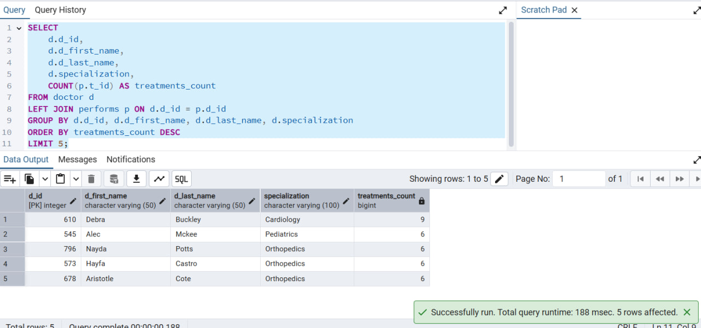

  ## 3. מטופלים שאושפזו וקיבלו טיפול כירורגי
שאילתה זו מאתרת מטופלים שהיו באשפוז (על סמך דוח מסוג 'Hospitalization') וקיבלו טיפול כירורגי (שמו 'Surgery'). היא מציגה את שם המטופל, גילו (חישוב באמצעות AGE), 

תאריך הדוח, שם הטיפול, ומידע על החדר והמיטה. השאילתה משתמשת במספר JOIN-ים בין הטבלאות patient, patient_report, treated_by, treatment ו־bed.

בנוסף, יש שימוש בתת־שאילתה פנימית שמחזירה את תאריך הדוח של כל מטופל.

  
  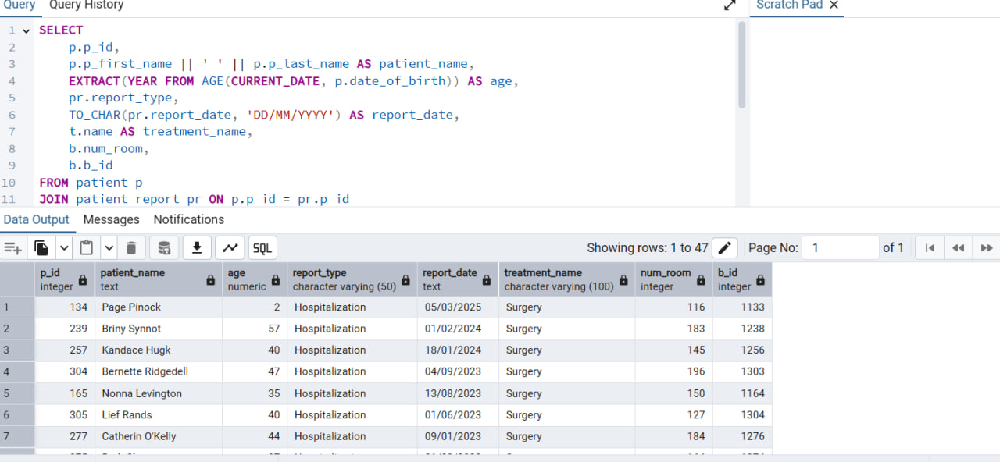

## 4. החודש עם הכי הרבה דוחות בכל שנה בעשור האחרון
שאילתה זו נועדה לאתר בכל שנה בעשור האחרון את החודש שבו נרשמה כמות הדוחות הגבוהה ביותר. המידע מבוסס על טבלת patient_report, וכולל שימוש ב־EXTRACT להוצאת שנה וחודש מתוך תאריך הדוח. 

נעשה שימוש ב־RANK() (פונקציית חלון) כדי לדרג את החודשים לפי מספר הדוחות בכל שנה, ולאחר מכן מסוננים רק החודשים המדורגים במקום הראשון בכל שנה (WHERE rnk = 1).

תוצאה זו מאפשרת לזהות תקופות שיא בפעילות הדיווח הרפואי.

  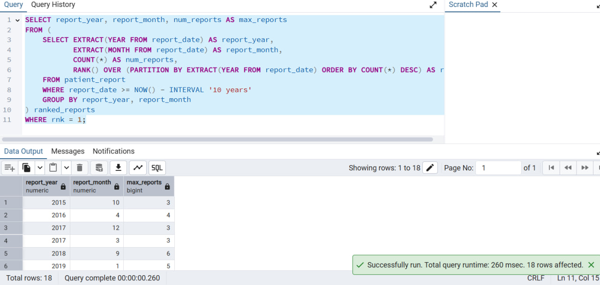

  ## 5. חמישה המטופלים שקיבלו הכי הרבה טיפולים (נולדו אחרי 2020)
שאילתה זו מציגה את חמשת המטופלים שנולדו בשנת 2020 ואילך (כלומר עד גיל 5), שקיבלו את מספר הטיפולים הרב ביותר. היא עושה שימוש ב־JOIN בין patient, treated_by ו־treatment, ובאמצעות COUNT סופרת את הטיפולים לכל מטופל.

תנאי הסינון מתבצע על פי השנה מתוך date_of_birth, והנתונים מקובצים לפי פרטי המטופל.

לבסוף, הנתונים ממוינים בסדר יורד ומוגבלים לחמישה מטופלים באמצעות LIMIT 5.

  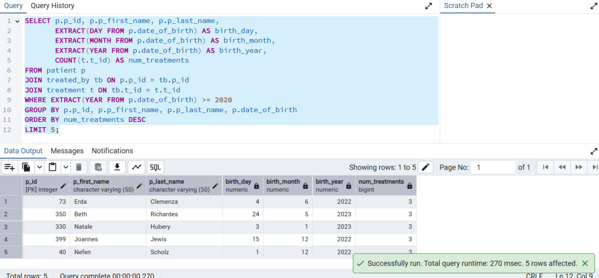

 ## 6. חמישה רופאים שביצעו יותר טיפולים מהממוצע הכללי
מטרת השאילתה היא להציג חמישה רופאים שביצעו יותר טיפולים מהממוצע הכללי של כלל הרופאים. נעשה שימוש ב־JOIN בין doctor ל־performs, יחד עם GROUP BY לפי מזהה הרופא.

תנאי הסינון ב־HAVING מבצע השוואה בין כמות הטיפולים של כל רופא לבין ממוצע כלל הרופאים, שנחושב בתת־שאילתה פנימית באמצעות AVG ו־GROUP BY. 

כך ניתן לזהות את הרופאים הבולטים ביותר מבחינת פעילות.

  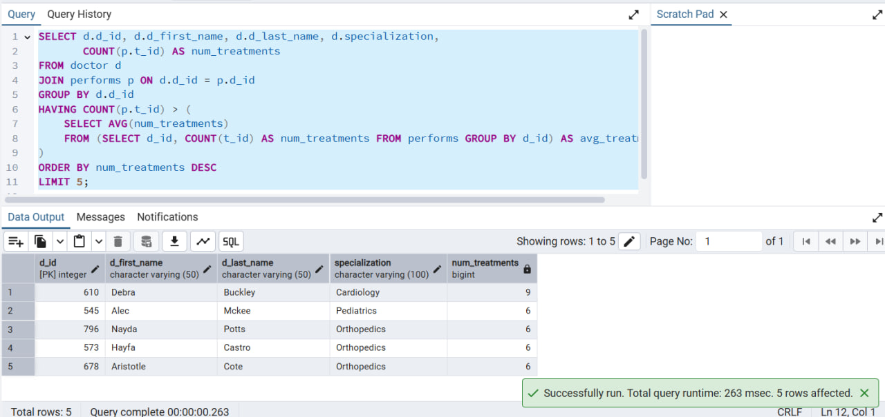

 ## 7. שלושת האחיות (אחת מכל משמרת) שביצעו הכי הרבה טיפולים
שאילתה זו מציגה את האחות שביצעה הכי הרבה טיפולים בכל משמרת (בוקר, ערב ולילה).

תחילה נבנית שאילתה עם פונקציית דירוג ROW_NUMBER() שמדרגת את האחיות לפי כמות הבדיקות שביצעו, תוך חלוקה לפי shift_schedule.

החיבור בין הטבלאות nurse, examination, ו־treated_by מאפשר לספור כמה טיפולים נקשרו לכל אחות דרך בדיקות. לבסוף, מסוננות רק האחיות שהן במקום הראשון בכל משמרת (WHERE rn = 1), ומוצגים פרטיהן כולל מספר הטלפון.

 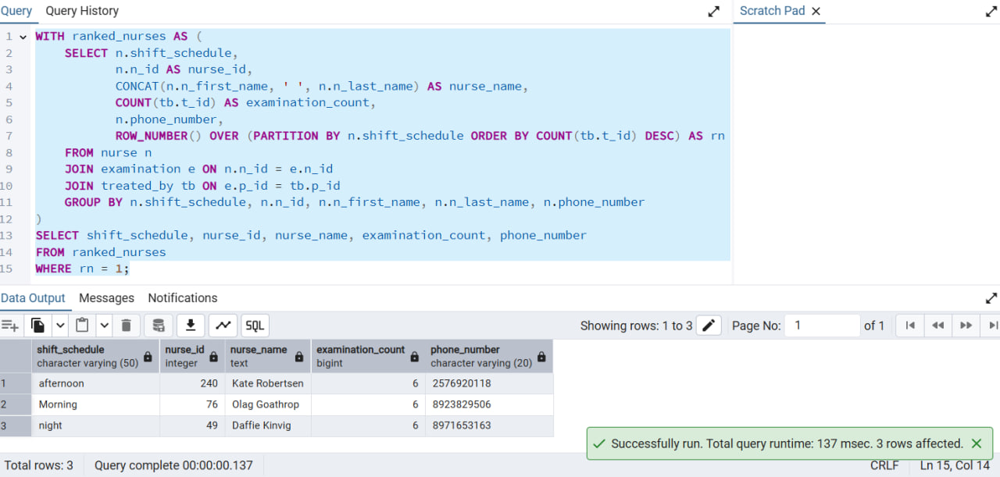

## 8. סיכום כמות הטיפולים וסוגי הטיפולים לכל מטופל
השאילתה מציגה נתונים על מטופלים, כולל כמות הטיפולים שהם עברו ושמות הטיפולים, באמצעות חיבור בין טבלת המטופלים (patient), טבלת טיפולי המטופלים (treated_by) וטבלת סוגי הטיפולים (treatment).

היא עושה שימוש בתתי-שאילתות כדי לחשב את כמות הטיפולים עבור כל מטופל באמצעות COUNT(*) וליצור רשימת טיפולים באמצעות STRING_AGG, המאגדת את שמות הטיפולים המופרדים בפסיקים. המידע מוצג לכל מטופל, וממויין לפי כמות הטיפולים בסדר יורד. 

השאילתה מאפשרת הצגת נתונים ברורים ומאורגנים, תוך שמירה על קריאות וארגון המבנה שלה. השימוש בתתי-שאילתות מבצע את החישובים בנפרד, מה שמקל על הבנת השאילתה ומייעל את ביצוע החישובים.

 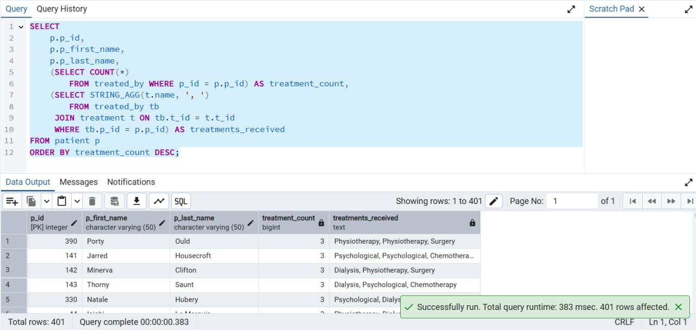

  ## יצירת שאילתות DELETE:
## 1. מחיקת רשומות מטבלת הבדיקות עבור מטופלים מחדרים 110–120
שאילתה זו מוחקת נתונים מטבלת examination עבור מטופלים המאושפזים בחדרים שמספרם בין 110 ל־120. באמצעות שאילתת משנה, מתבצע JOIN בין הטבלאות patient ו־bed כדי לזהות את המטופלים ששויכו למיטות בחדרים אלו. 

לאחר מכן, מזהי המטופלים משמשים לבחירת רשומות רלוונטיות למחיקה מטבלת הבדיקות. והנתונים מוצגים לפי סדר עולה של מספר החדר.

בסיס הנתונים לפני המחיקה - ניתן לראות שישנם מטופלים שנבדקים, ןהם בחדר 110:

 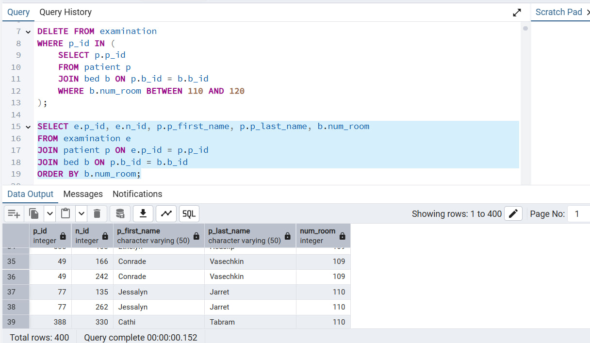

בעת המחיקה:
 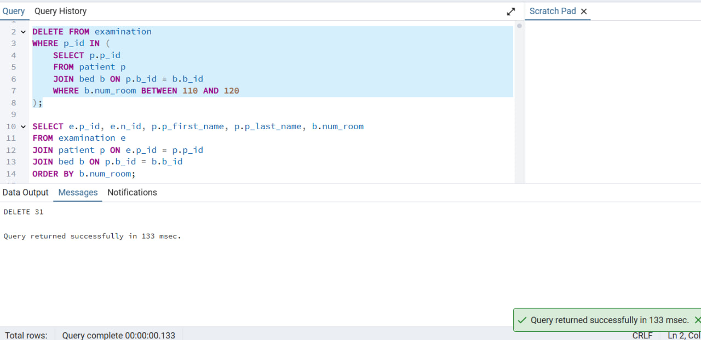

לאחר המחיקה - ניתן לראות שמחדר 109 קופצים לחדר 121 (באמת נמחקו הנתונים)

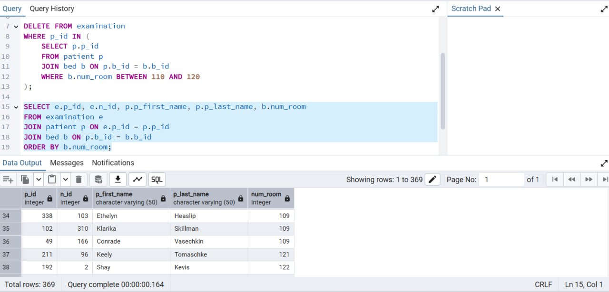

## 2. מחיקת דוחות מסוג 'observation' למטופלים עם פחות משני טיפולים
במקרה זה, נמחקים דוחות רפואיים מטבלת patient_report שמסוגם 'observation' ונכתבו עבור מטופלים שקיבלו פחות משני טיפולים. 

תת־השאילתה מבצעת GROUP BY לפי מזהה מטופל בטבלת treated_by, ומזהה מטופלים שקיבלו פחות משני טיפולים באמצעות HAVING COUNT(t_id) < 2. בכך, נשמרים רק דוחות רלוונטיים יותר להיסטוריה רפואית משמעותית.

לפני המחיקה - ניתן לראות שאנו מציגים את דוחות המטופלים עם פחות מ2 טיפולים, ויש גם מטופלים עם דוח מסוג observation

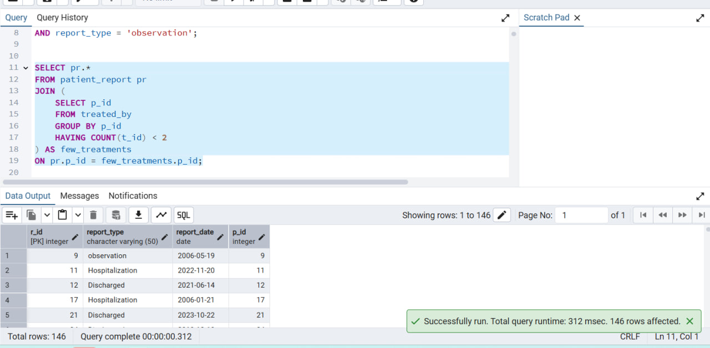

בעת המחיקה:

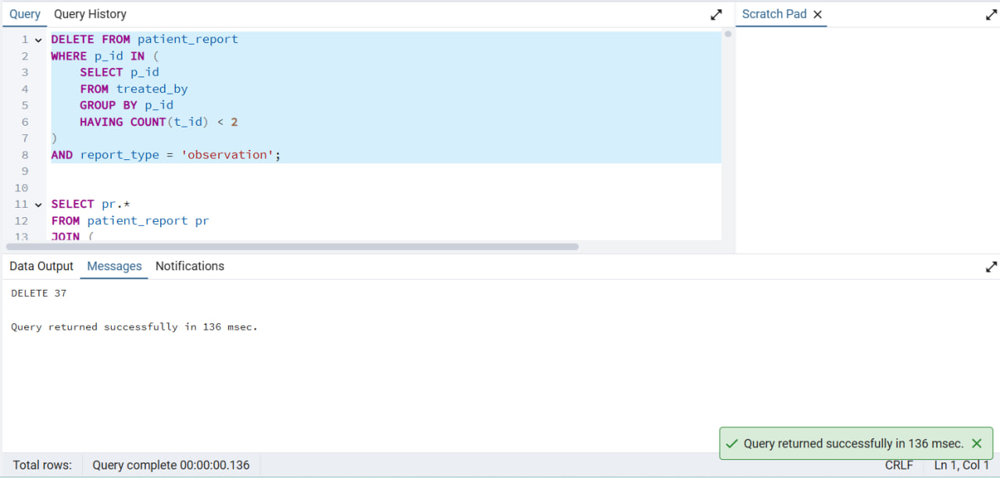

לאחר המחיקה - ניתן לראות שמטופל עם id = 9 לא נמצא, כנדרש.
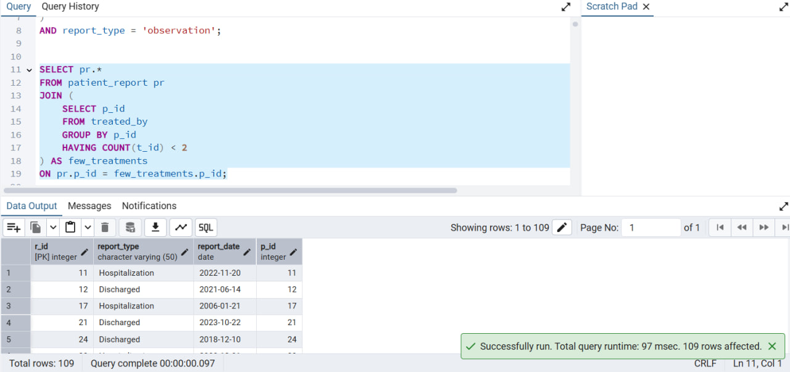

## 3. מחיקת רופאים שלא ביצעו טיפולים, מתוך תחומים ספציפיים
שאילתה זו מוחקת מרשימת הרופאים את אלו שלא ביצעו אף טיפול (לא מופיעים בטבלת performs), ושתחום ההתמחות שלהם הוא אונקולוגיה או רפואת ילדים. 

בעזרת תת־שאילתה שמחזירה את כל מזהי הרופאים שביצעו טיפולים (SELECT DISTINCT d_id FROM performs), מבוצע סינון של רופאים שאין להם פעילות רפואית מוקלטת, תוך הגבלה לתחומי התמחות מסוימים בלבד באמצעות IN.

לפני המחיקה - ניתן לראות שיש רופאים ללא טיפולים שמתמחים באונקולוגיה או רפואת ילדים.

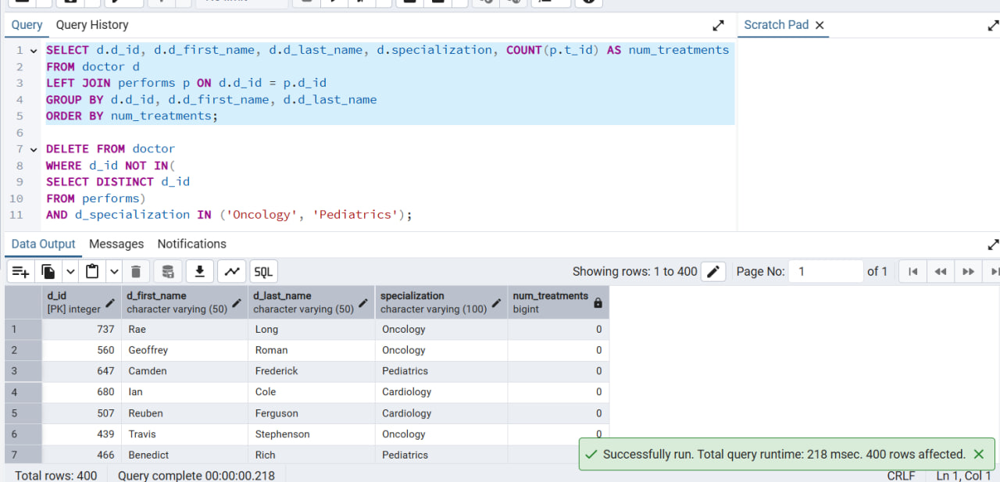

בעת המחיקה: 

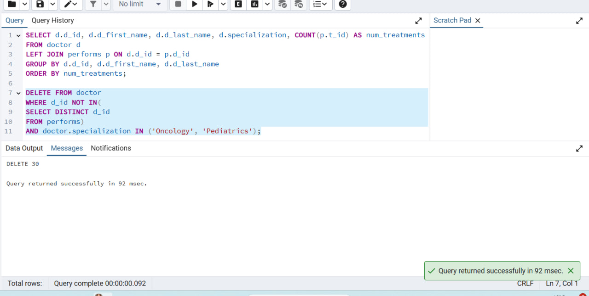

לאחר המחיקה - ניתן לראות שנמחקו הרופאים ללא הטיפולים שמתמחים בבתמחויות אונקולוגיה או רפואת ילדים.

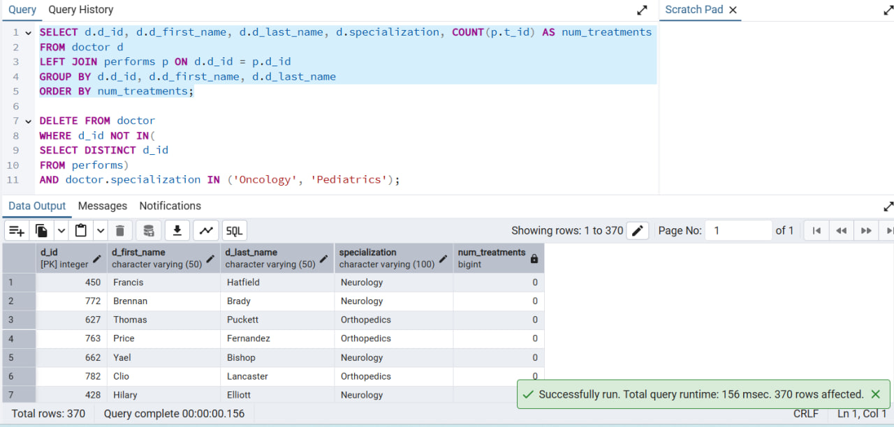

  ## יצירת שאילתות UPDATE:

##  1. עדכון משמרת לאחיות שטיפלו בדיוק בשני מטופלים במשמרת אחר־הצהריים
שאילתה זו משנה את משמרת העבודה של אחיות ממשמרת אחר־הצהריים (afternoon) למשמרת לילה (night),

בתנאי שהאחות טיפלה בדיוק בשני מטופלים שונים. השאילתה מבצעת JOIN בין הטבלאות nurse ו־examination כדי לקשר בין האחות לבדיקה, ולאחר מכן מתבצע GROUP BY לפי מזהה האחות (n_id) תוך שימוש ב־HAVING COUNT(DISTINCT e.p_id) = 2 כדי לאתר אחיות שטיפלו בדיוק בשני מטופלים ייחודיים. השינוי מתבצע באמצעות פעולת UPDATE ממוקדת.

לפני העדכון - ניתן לראות שיש אחיות עם 2 מטופלים והמשמרת שלהן היא צהריים

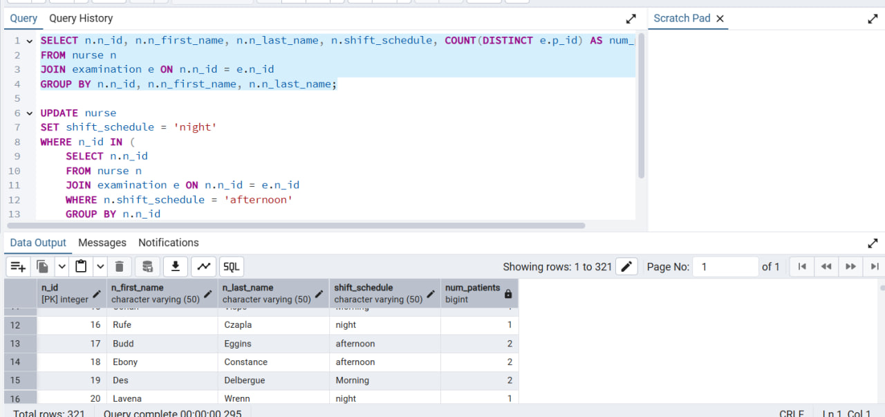

בעת העדכון:

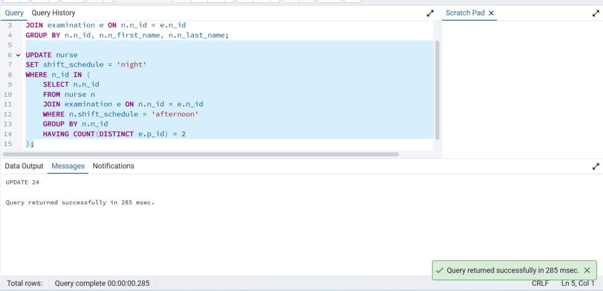

לאחר העדכון - ניתן לראות שהמשמרת של אחיות אלו עודכן למשמרת לילה
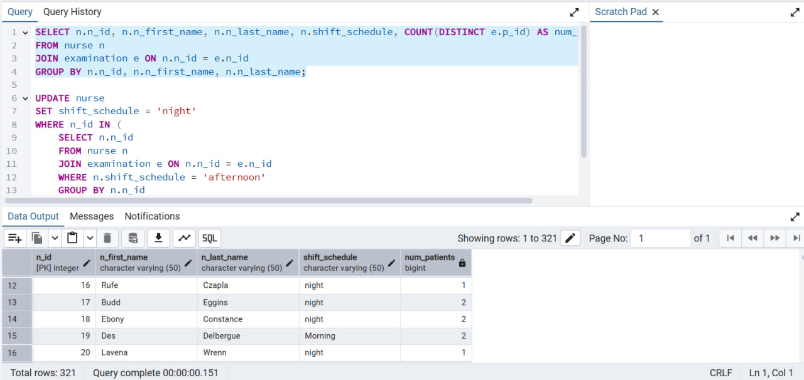

## 2. עדכון תחום ההתמחות לרופאים שביצעו מעל חמישה טיפולים
במקרה הזה, השאילתה מעדכנת את תחום ההתמחות של רופאים ל־'Surgery' עבור רופאים שביצעו יותר מחמישה טיפולים בפועל. 

תת־השאילתה בוחנת את טבלת performs ומבצעת GROUP BY לפי מזהה הרופא, יחד עם תנאי HAVING COUNT(t_id) > 5 כדי לאתר רופאים עם ניסיון משמעותי במספר טיפולים. לאחר זיהוי הרופאים, השאילתה מעדכנת את תחום ההתמחות שלהם בהתאם.

לפני העדכון - ניתן לראות שיש התמחויות אחרות לרופאים שביצעו יותר מ5 טיפולים

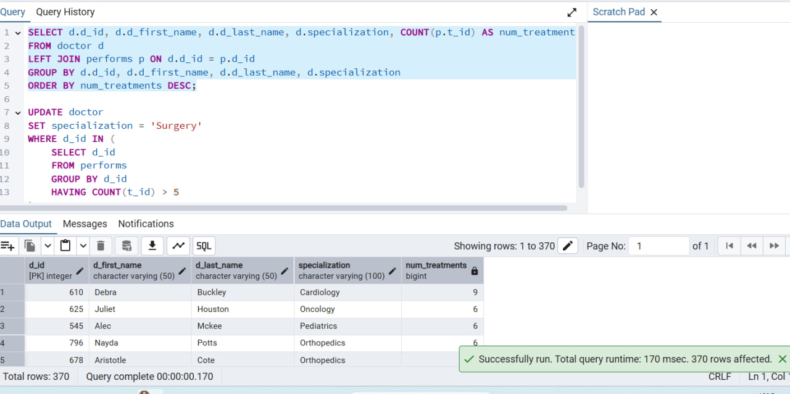

בעת העדכון: 

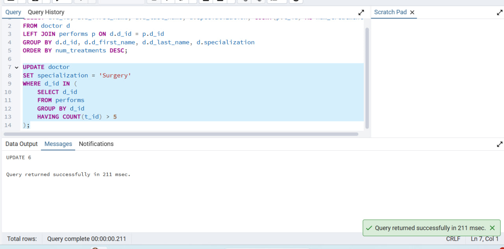

לאחר העדכון - ניתן לראות שההתמחות של האופרים שביצעו יותר מ5 טיפולים עודכנה ל-Surgery

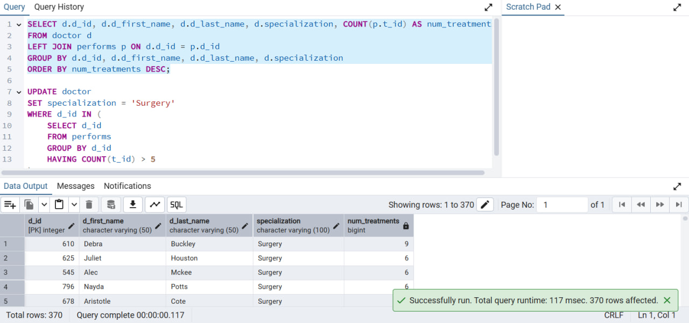

## 3. עדכון זמן המתנה לאחר טיפול לפי סוג טיפול
שאילתה זו מעדכנת את זמן ההמתנה (wait_after) הנדרש לאחר ביצוע טיפול רפואי, בהתאם לסוג הטיפול. עבור טיפולים מסוג 'Surgery', זמן ההמתנה מוכפל פי 2.

עבור טיפולים מסוג 'Chemotherapy', מתווספות שעתיים לזמן ההמתנה. הפעולה מתבצעת באמצעות CASE WHEN המאפשרת לוגיקה מותנית בתוך פקודת UPDATE, ותחולת העדכון מוגבלת לשמות טיפולים מסוימים דרך התנאי WHERE name IN ('Surgery', 'Chemotherapy').

לפני העדכון - מוצגות השעות המקוריות

בעת העדכון:

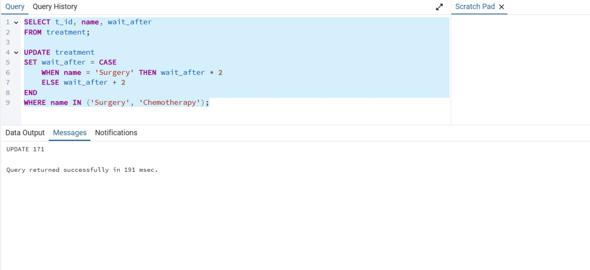

לאחר העדכון - ניתן לראות שזמן ההמתנה אחרי הטיפולים התעדכן בהתאם

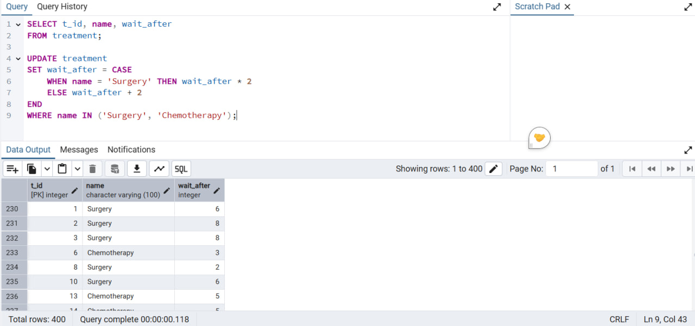

  ## יצירת אילוצים:

  ## 1.  אילוץ זמן ההמתנה בטיפול (טבלת treatment)

האילוץ מוודא שכל טיפול שמוזן למערכת יכיל ערך חוקי לזמן ההמתנה לאחריו (wait_after). בעזרת CHECK שמחייב שהערך יהיה לפחות 0,

נמנעת הזנת ערכים שליליים, מה ששומר על תקינות הנתונים והיגיון רפואי בסיסי.

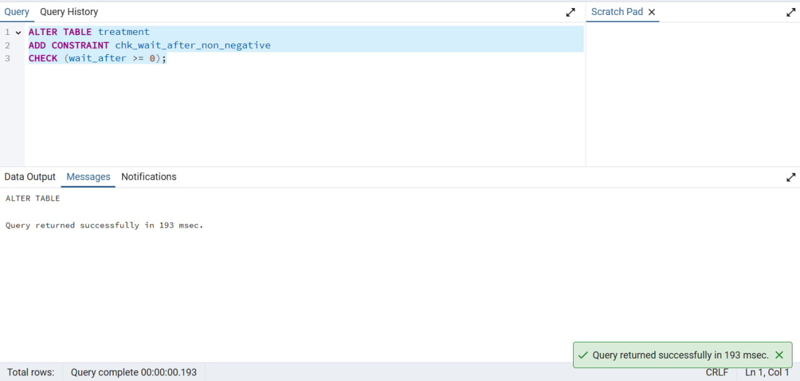

ניתן לראות שכשמזינים ערך שסותר את האילוץ מופיעה שגיאה:
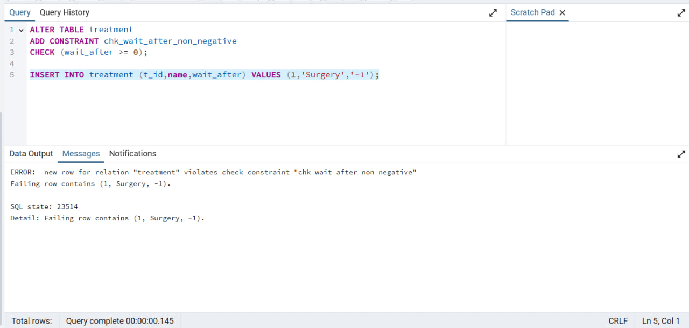

## 2. אילוץ שם פרטי למטופלים (טבלת patient)
האילוץ מוודא שכל מטופל במערכת חייב לכלול שם פרטי (p_first_name) שאינו NULL. זה נעשה באמצעות הגדרת NOT NULL,

על מנת להבטיח שלכל רשומת מטופל יהיו פרטים מזהים מלאים ונכונים.

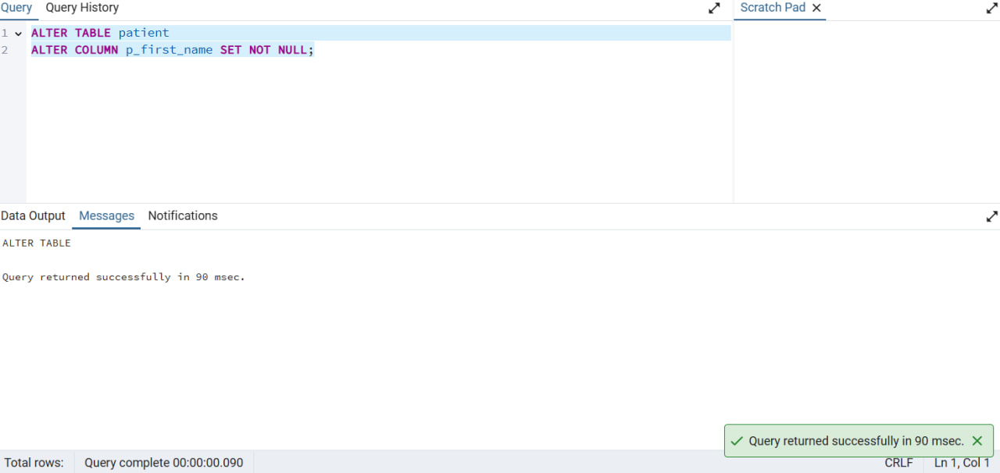

ניתן לראות שכשמזינים ערך שסותר את האילוץ מופיעה שגיאה:

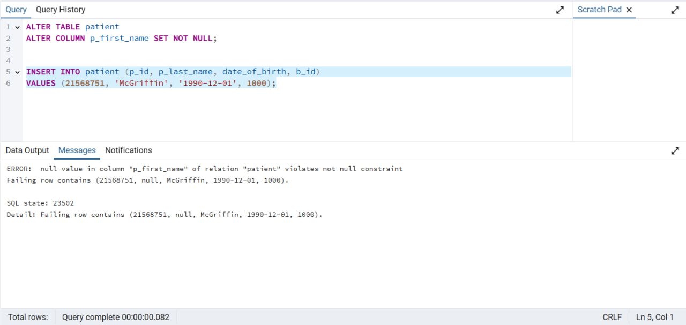

## 3. ערך ברירת מחדל למשמרת אחות (טבלת nurse)
באילוץ זה מוגדרת ברירת מחדל לשדה shift_schedule, כך שאם לא צוין אחרת, כל אחות תוגדר אוטומטית כמשובצת למשמרת בוקר (morning).

האילוץ שומר על עקביות ומונע ערכים חסרים בעת הזנת רשומות חדשות.

ניתן לראות שההכנסת ברירת מחדל באמת עובדת:

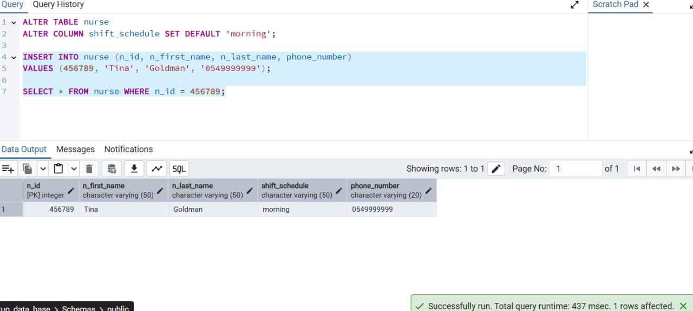

## פקודות rollback and commit

## פקודת rollback:

המשמרת המקורית של האחות:

הרצת העדכון:
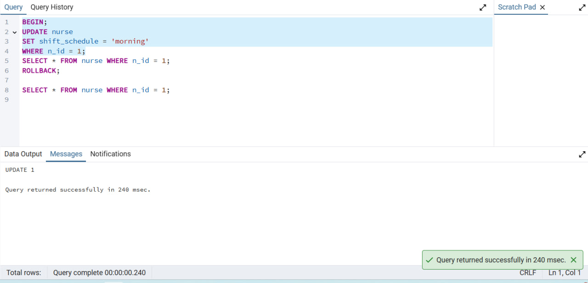

הצגת העדכון:
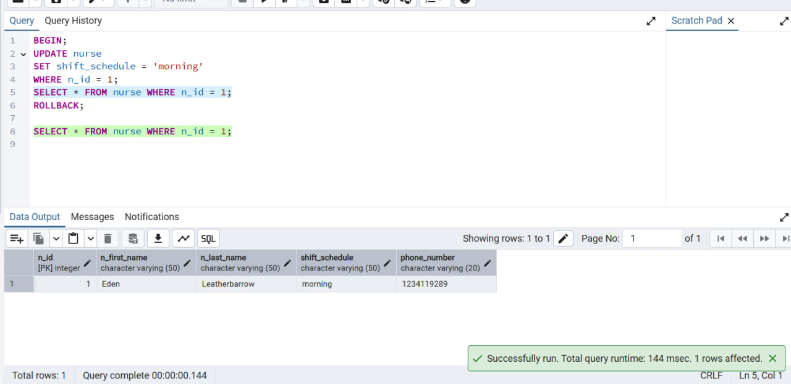

פקודת rollback: 
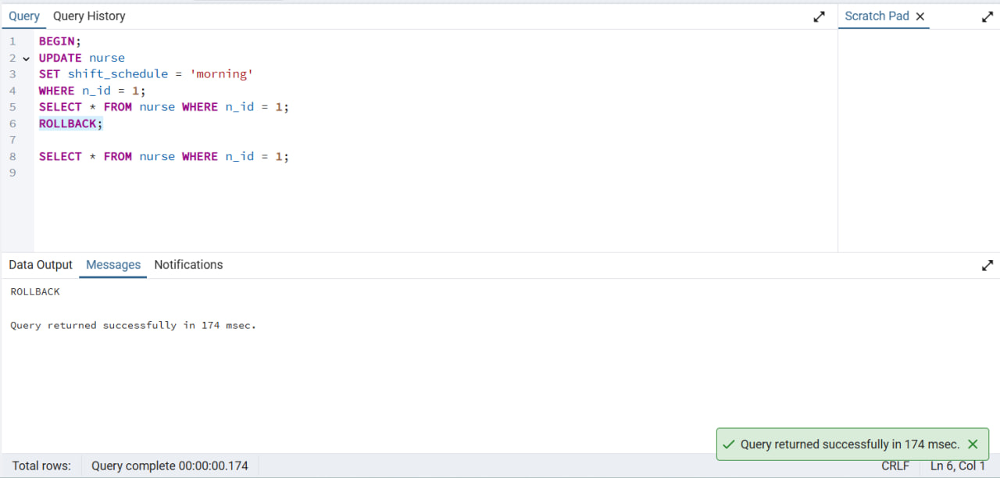

בסיס הנתונים חזר להיות כפי שהיה:
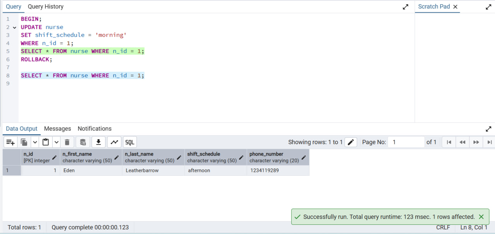

## פקודת commit:

המשמרת המקורית של האחות:
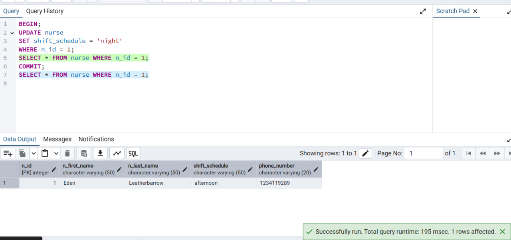

הרצת העדכון:
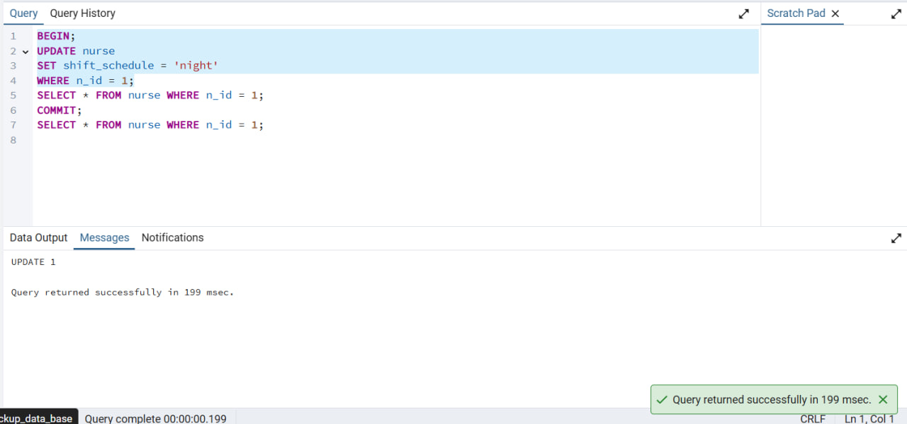

הצגת העדכון:
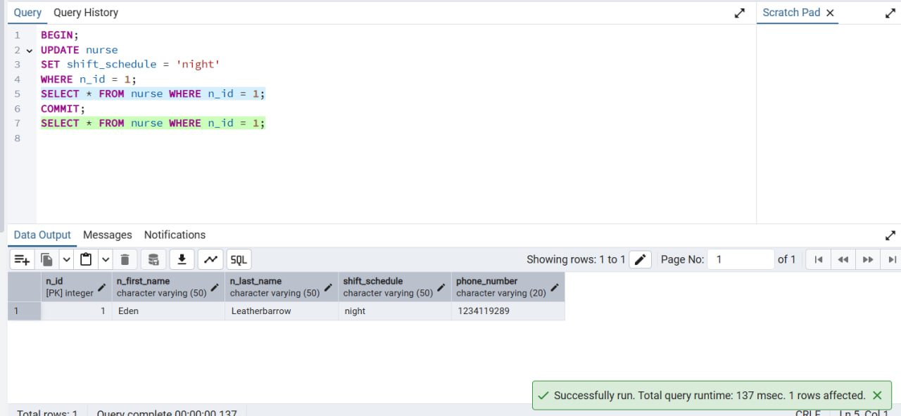

פקודת commit: 
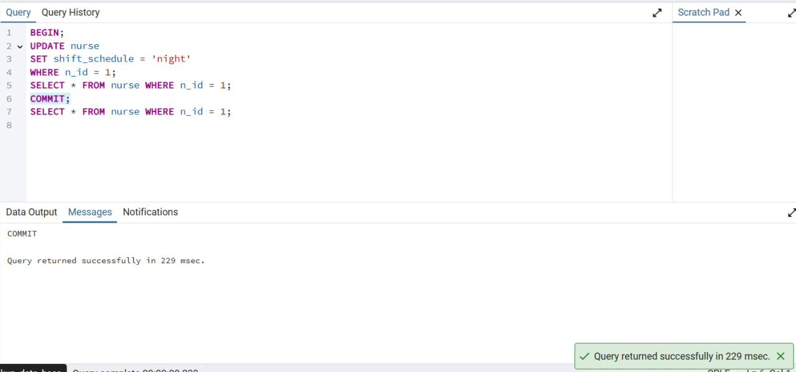

בסיס הנתונים אכן נשאר מעודכן:
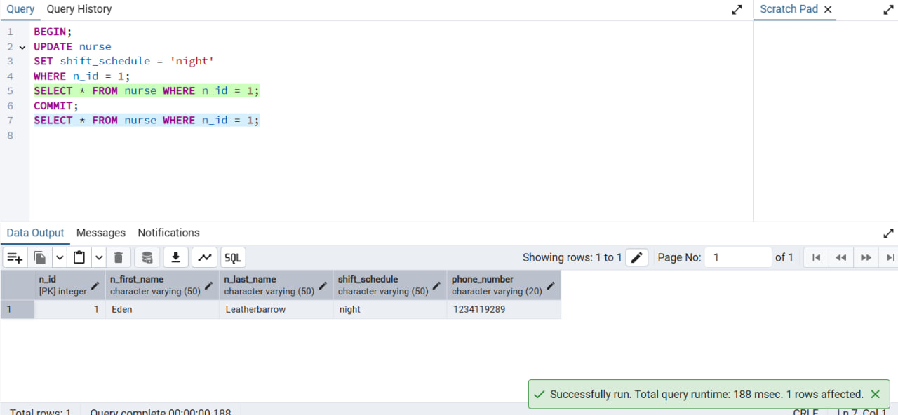

## שלב ג - אינטגרציה ומבטים
קיבלנו את קובץ גיבוי בסיס הנתונים של מערך המתנדבים של בית החולים, ועל ידי הסתכלות בפקודות יצירת הטבלאות של בסיס נתונים זה, ראינו אילו טבלאות מכילות מפתחות זרים ואילו לא, 

וכך הצלחנו לשחזר את דיאגרמת הDSD של בסיס הנתונים שקיבלנו, וממנו שחזרנו את דיאגרמת ה-ERD.

## שחזור DSD:
א. בשלב הראשון יצרנו את כל הישויות שאינן תלויות בשום ישות אחרת
   
ב. בשלב השני זיהינו מה הן הטבלאות שיש לנו מפתח זר של טבלה אחרת, והקפדנו ליצור קודם את הטבלה בהן הן תלויות ואז אותן.
   
ג. זיהינו תכונות מורכבות במידת הצורך.
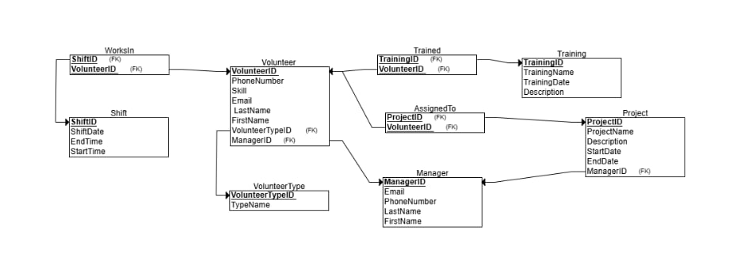   

## שחזור ERD:

אלגוריתם: המרה מ־DSD ל־ERD

שלב 1: 

ניתחנו את המבנה הכללי של ה־DSD

עבור כל טבלה (או רשומה) במודל DSD:

בדקנו את שם הרשומה, השדות ו־סוגי הנתונים.

סימנו שדות שהיו מפתחות ראשיים (Primary Key) או שדות מזהים ייחודיים – והשתמשנו בהם כבסיס לזיהוי ישויות (Entities).

שלב 2:

זיהינו את הישויות (Entities)
כל רשומה ראשית (שאינה תלויה ברשומה אחרת) הפכה ל־ישות ב־ERD.

נתנו לכל ישות את שם הרשומה וצירפנו אליה את כל השדות שאינם מקשרים לישויות אחרות כמאפיינים (Attributes).

שלב 3: 

זיהינו את הקשרים בין הישויות (Relationships)

עבור כל שדה ששימש כ־Foreign Key (מפתח זר):

הבנו שמדובר ב־קשר בין שתי ישויות.

קבענו את סוג הקשר:

אם כל מופע בישות אחת מתאים למופע יחיד באחרת – זהו יחס 1:1.

אם מופע בישות אחת מתאים למספר מופעים בישות השנייה – זהו יחס 1:N.

אם כל אחד יכול להתאים לרבים ולהיפך – זהו יחס N:M, והוספנו טבלת קשר מתאימה.

שלב 4: 

ניתחנו טבלאות קשר

כאשר מצאנו רשומות שמכילות רק מפתחות זרים:

זיהינו שמדובר בטבלאות קשר שמייצגות יחסי N:M.

יצרנו ישות מקשרת או קשר בין שתי הישויות המתאימות, והעברנו אליהן מאפיינים רלוונטיים אם היו.

   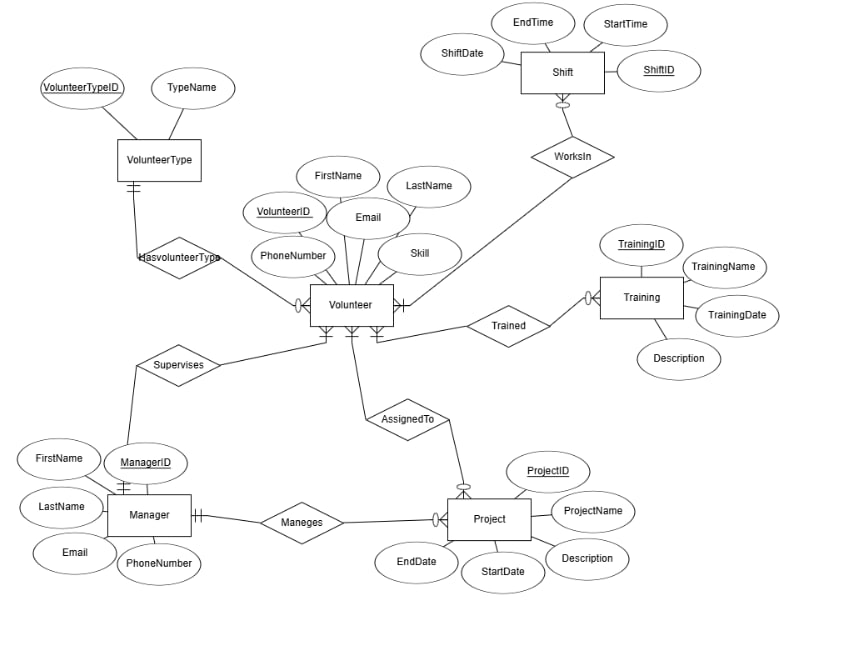   

## יצירת ERD משולב של שני בסיסי הנתונים:

על מנת למזג את שני בסיסי הנתונים לבסיס נתונים אחד בצורה המיטבית, הלחטנו להוסיף את השינויים הבאים:

א. נוסיף טיפול לטבלה של הפרויקטים, כלומר כך נדע עבור כל פרויקט לאיזה טיפול הוא משוייך.

ב. נוסיף אחות אחראית לטבלת המתנדבים.

ג. נוסיף הכשרה לטבלת הטיפולים (לא חובה הכשרה עבור כל טיפול).

ד. ניצור טבלה חדשה של חולים ומתנדבים - לכל חולה יכולים להיות כמה מתנדבים שמטפלים בו ולכל מתנדב יכולים להיות כמה חולים שמטפל בהם.

ה. נמזג את הטבלאות של רופא ומנהל לטבלה אחת (כי בעצם המנהלים במקרה שלנו הם רופאים).

 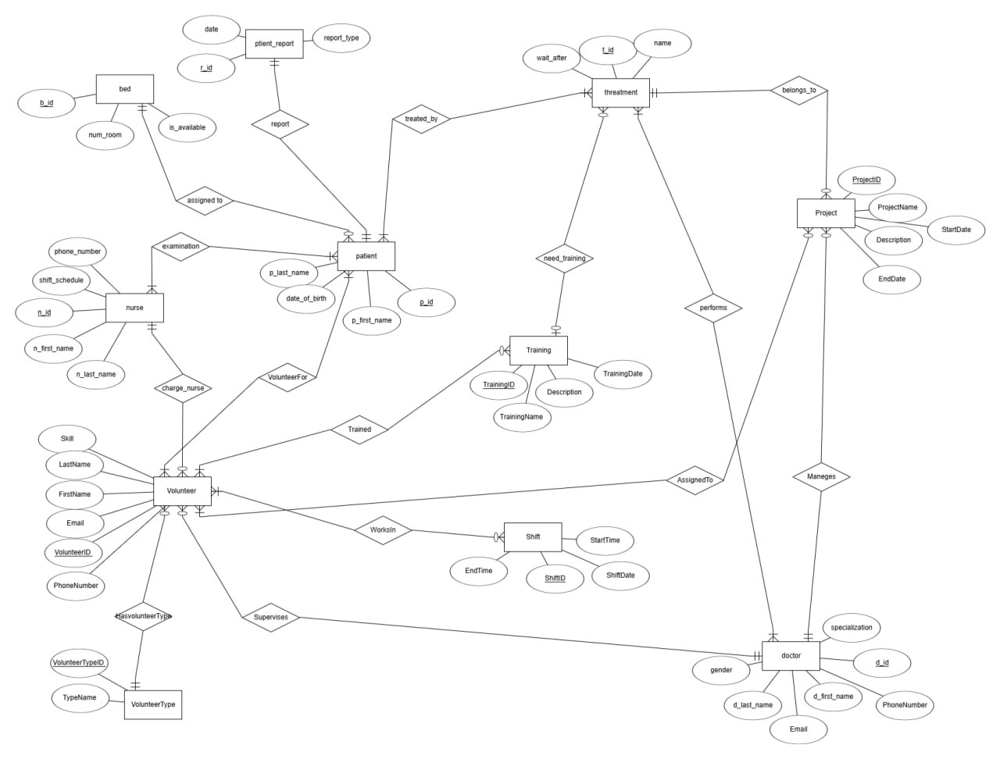  

 ## יצירת DSD משולב של שני בסיסי הנתונים:

 מתוך ה ERD שיצרנו, ניצור את ה DSD המתאים:

  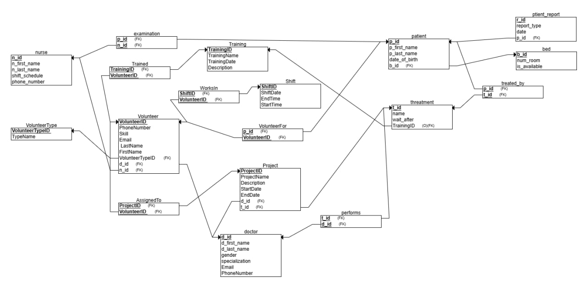 

  ## הסבר על התהליך והפקודות לשילוב שני בסיסי הנתונים:

## עבור סעיפים א, ב, ג:
הוספנו עמודה חדשה לטבלאות על ידי הפקודה ALTER TABLE וקישרנו את העמודה החדשה שתהיה מפתח זר לטבלה הרצויה שממנה נרצה למלא את העמודה, ומילאנו את העמודה עבור כל טבלה על ידי פקודת UPDATE. (מילוי העמודה היה כמובן מהטבלה הרצויה ולא נתונים חדשים)

הפקדות:

נוסיף טיפול לטבלה של הפרויקטים - כלומר כל פרויקט לאיזה טיפול הוא משוייך

  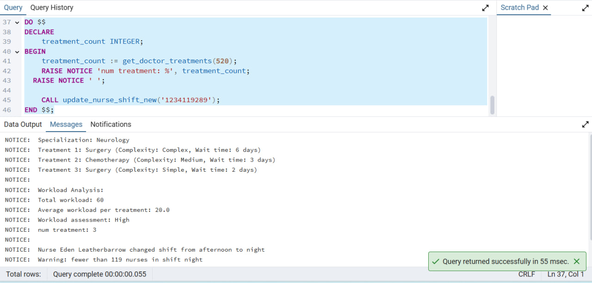 

נוסיף אחות אחראית לכל מתנדב

 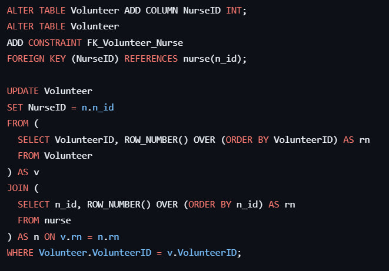 

נוסיף הכשרה לטבלת הטיפולים (לא חייבת להיות הכשרה עבור כל טיפול)

  

## עבור סעיף ד:

יצרנו טבלה חדשה על ידי הפקודה CREATE TABLE, ומילאנו את הרשומות בטבלה מהמפתחות של הטבלאות של מתנדבים ומטופלים. כמובן שקישרנו את העמודות להיות מפתחות זרים של הטבלאות של מתנדבים ומטופלים.

 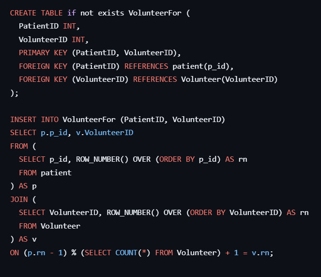 

## עבור סעיף ה:

נפרט את התהליך שעשינו:

א. הוספנו את השדות email ו־phone_number כדי שתכיל את המידע שהיה בטבלת manager.

ב. לכל רופא קיים הוקצה מייל ומספר טלפון מדומים לפי ה־d_id, למשל: doctor7@hospital.org.

ג. הועתקו כל המנהלים הקיימים לטבלת doctor, תוך שיוך ערכי ברירת מחדל בעמודות שלא קיימות אצל המנהלים.

ד. עודכנו הקשרים כך שהשדות ManagerID בטבלאות הללו יפנו כעת ל־doctor(d_id) במקום ל־manager(ManagerID).

ה. לאחר שכל התלות הוסרה, נמחקה טבלת manager שכן כל המידע שבה מוזג ונקלט בטבלת doctor.

 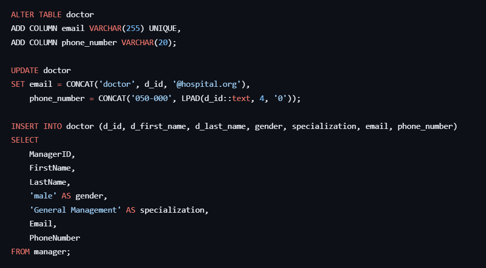 
 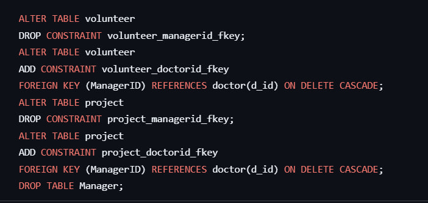 

 

## יצירת מבטים:

## מבט ראשון:

המבט patient_treatment_doctor_view מאחד נתונים מכמה טבלאות כדי להציג את הקשרים בין מטופלים, טיפולים ו־רופאים. המבט מחבר את טבלת treated_by (הכוללת את הקשרים בין מטופלים לטיפולים) עם טבלאות נוספות, כגון patient, treatment, performs, ו־doctor.

המבט מציג את המידע הבא:

מטופל: מזהה המטופל (p_id), שם פרטי ושם משפחה של המטופל.

טיפול: מזהה הטיפול (t_id) ושם הטיפול.

רופא: מזהה הרופא (d_id), שם פרטי ושם משפחה של הרופא.

החיבורים (JOIN) מאפשרים לחשוף אילו טיפולים קיבלו המטופלים, על ידי אילו רופאים, וכיצד כל אחד מהם מקושר באופן ישיר לטיפול. המבט מהווה כלי נוח להציג את המידע בצורה מאוחדת, ומסייע בניתוח הקשרים בין מטופלים לרופאים ולטיפולים.

 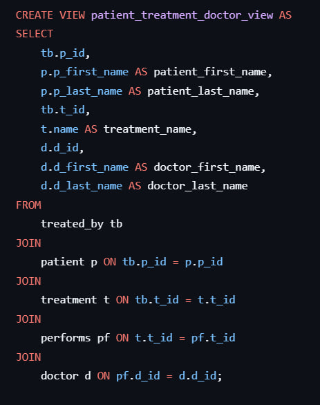 

 הרצת ה-view:

  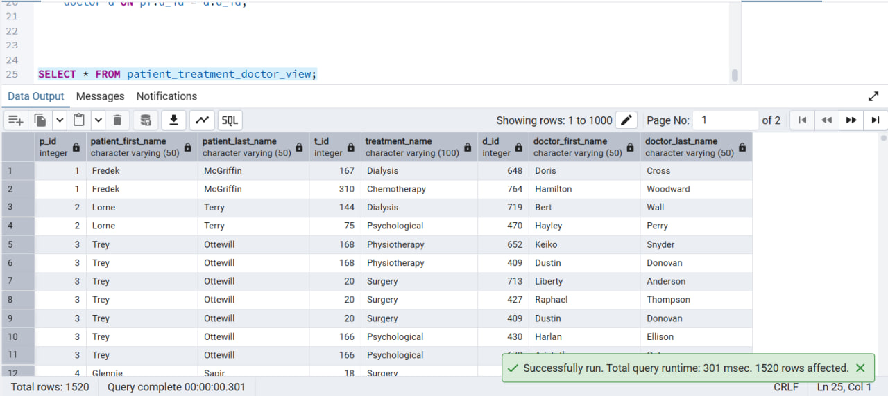 

  שאילתה ראשונה:

  שאילתה זו מחשבת עבור כל רופא את מספר המטופלים השונים (ייחודיים) שטופלו על ידו. השאילתה משתמשת במבט patient_treatment_doctor_view,
  
  מבצעת קיבוץ לפי מזהה הרופא ושמו, ומחשבת את מספר המטופלים הייחודיים באמצעות COUNT(DISTINCT p_id). לבסוף, התוצאה ממוינת לפי מספר המטופלים בסדר יורד, כך שהרופא שטיפל במספר המטופלים הרב ביותר יופיע ראשון.

 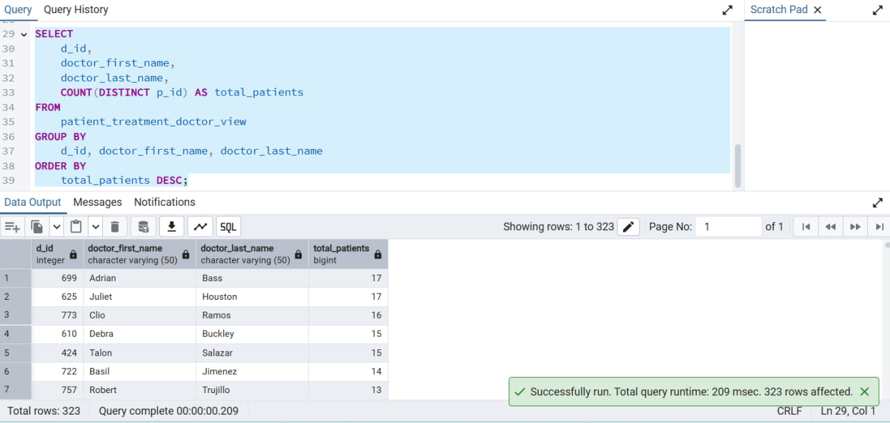 

 שאילתה שניה:
שאילתה זו מציגה את מספר הפעמים שכל טיפול בוצע על ידי כל רופא. היא משתמשת במבט patient_treatment_doctor_view, מבצעת קיבוץ לפי שם הטיפול ושם הרופא,

וסופרת את מספר הרשומות עבור כל שילוב של טיפול ורופא בעזרת COUNT(*). לבסוף, התוצאה ממוינת בסדר יורד לפי מספר הפעמים שהטיפול בוצע, כך שהשילובים הנפוצים ביותר של רופא וטיפול יוצגו בראש הרשימה.

 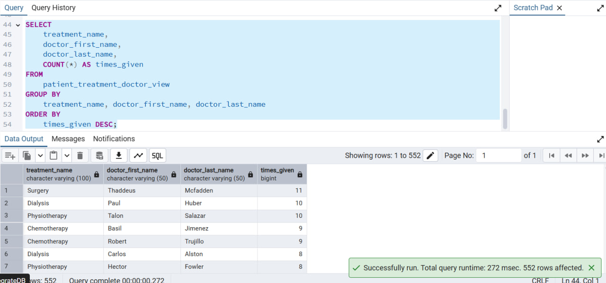 

 
## מבט שני:

המבט volunteer_project_training_view מאחד מידע ממספר טבלאות כדי להציג תמונה מלאה על מתנדבים, סוג ההתנדבות שלהם, הפרויקטים בהם הם משתתפים, ההכשרות שעברו, ומנהלי הפרויקטים. המבט יוצר טבלה וירטואלית הכוללת:

פרטי המתנדב (מזהה, שם פרטי ושם משפחה),

סוג המתנדב (למשל סטודנט, גמלאי),

שם הפרויקט בו הוא משתתף,

שם ההכשרה שעבר,

ושם פרטי ושם משפחה של הרופא המנהל של הפרויקט.

באמצעות חיבורים (JOIN) בין טבלאות כמו Volunteer, VolunteerType, Project, Doctor, Trained ו־Training, המבט מאפשר לקבל בקלות תצוגה מקיפה של הקשרים בין המתנדב, ההכשרות שקיבל, והפרויקטים בהם הוא מעורב, כולל מידע על המנהל האחראי.

 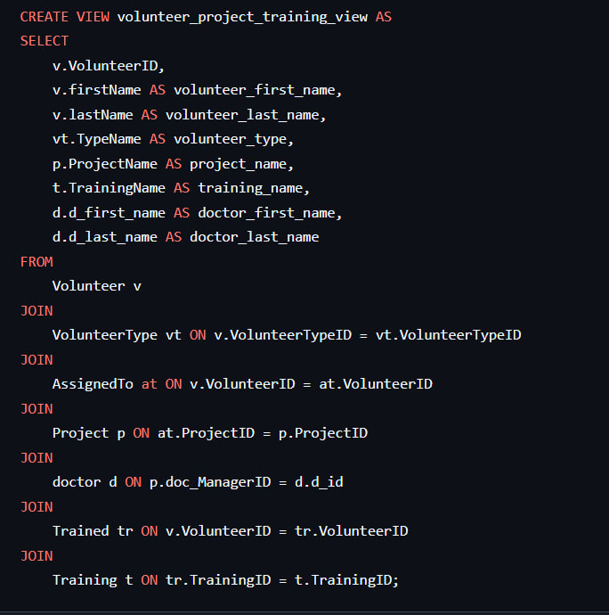 

 הרצת ה-view:
 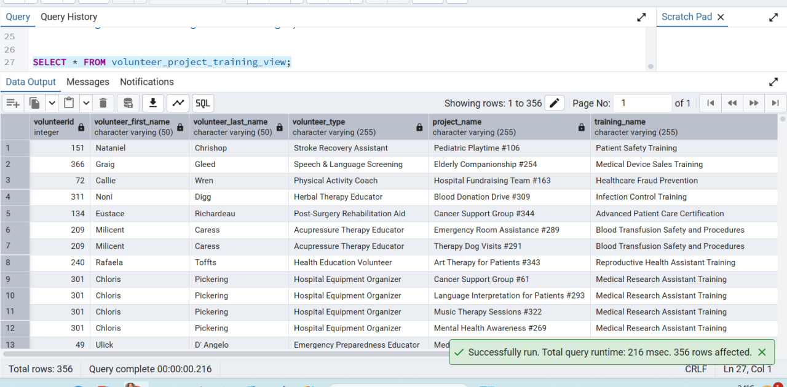
 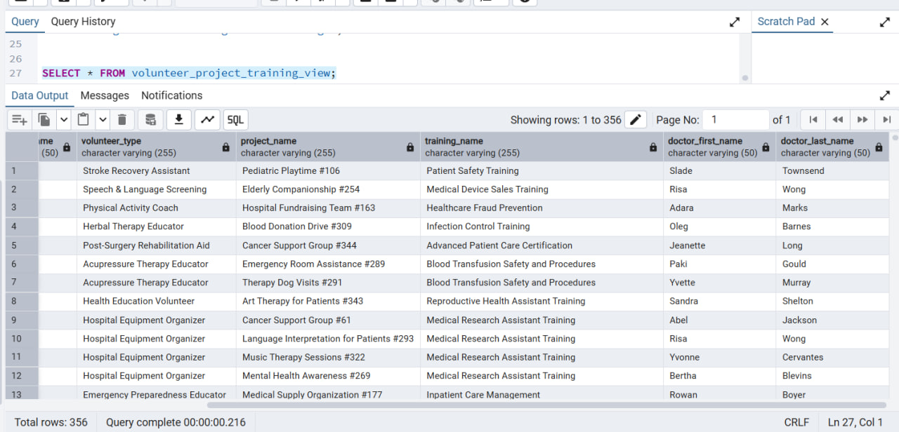
 
 
שאילתה ראשונה:
  
שאילתה זו מציגה עבור כל סוג הכשרה את מספר המתנדבים הייחודיים שעברו אותה. היא משתמשת במבט volunteer_project_training_view, 

מקבצת את הנתונים לפי שם ההכשרה (training_name) ומחשבת את מספר מזהי המתנדבים השונים (COUNT(DISTINCT VolunteerID)) בכל קבוצה.

כך ניתן לראות איזו הכשרה הייתה הפופולרית ביותר או הנפוצה ביותר בקרב המתנדבים.

   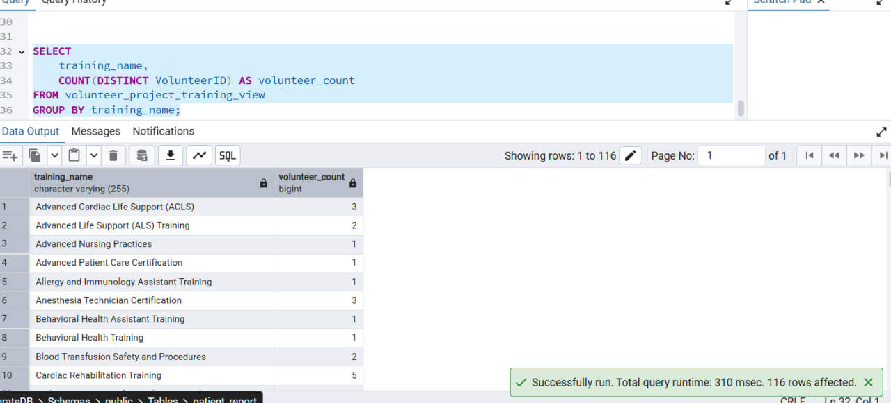 

 שאילתה שניה:

 השאילתה מציגה את שמות המתנדבים שביצעו יותר מהכשרה אחת והשתתפו ביותר מפרויקט אחד.
 
 עבור כל מתנדב היא סופרת את מספר ההכשרות והפרויקטים הייחודיים שלו. התוצאה ממוינת בסדר יורד לפי מספר ההכשרות, כך שהמתנדבים עם הכי הרבה הכשרות יופיעו ראשונים.

   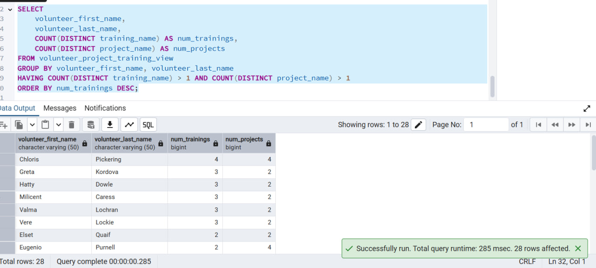 

   ## שלב ד – תכנות

   יצרנו עבור בסיס הנתונים שתי פונקציות, שתי פרוצדורות, שתי תוכניות ראשיות שכל אחת מהן מזמנת אחת מהפונקציות ואחת מהפרוצדורות שכתבנו
   
   ושני טריגרים עבור פעולות הוספה / עדכון של טבלאות מסויימות בבסיס הנתונים.

## פונקציה 1

הפונקציה get_volunteer_info נועדה להחזיר מידע על הדרכות ופרויקטים של מתנדב לפי כתובת האימייל שלו, עם אפשרות למיין את התוצאות לפי תאריך, שם או סוג פעילות, ובסדר עולה או יורד. הפונקציה עושה שימוש ב־REFCURSOR לצורך החזרת התוצאה כמצביע פתוח, וב־EXECUTE להרצת שאילתה דינמית שמאחדת בין טבלאות training ו־project. 
בנוסף, נעשה שימוש במשתנים מקומיים, מבני תנאי (IF...ELSIF), טיפול בשגיאות (EXCEPTION) ופקודת SELECT INTO לשליפת מזהה המתנדב מתוך כתובת האימייל.

 
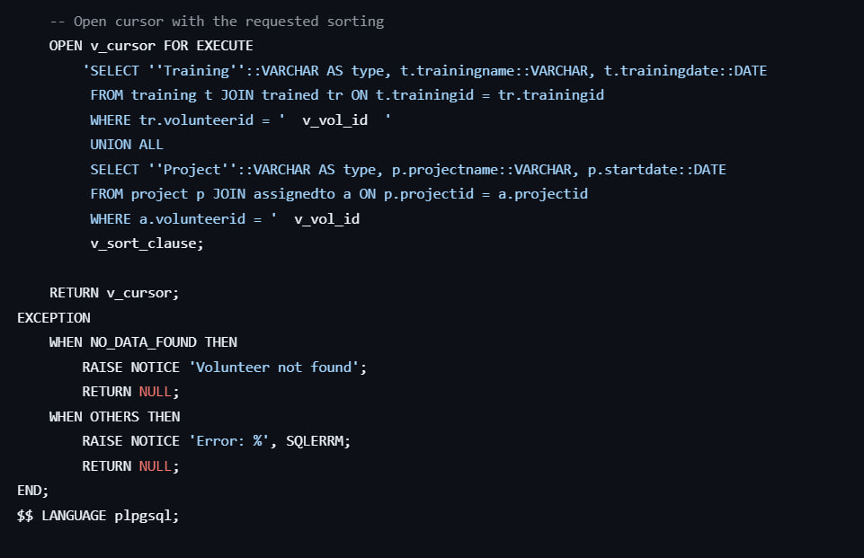 

## פונקציה 2

הפונקציה get_doctor_treatments מקבלת מזהה רופא ומחזירה את מספר הטיפולים שביצע. הפונקציה סורקת את כל הטיפולים של הרופא, מחשבת את רמת המורכבות של כל טיפול לפי זמן ההמתנה שלאחריו, ומעריכה את העומס הכולל של הרופא בהתאם (עומס = מורכבות × 10). הפונקציה עושה שימוש בלולאת FOR עם רשומת RECORD, משתנים מקומיים, מבני CASE להערכת מורכבות, והודעות RAISE NOTICE לצורך תיעוד ביניים. כמו כן, יש טיפול בשגיאות באמצעות EXCEPTION, ושימוש ב־SELECT INTO לשליפת ההתמחות של הרופא.

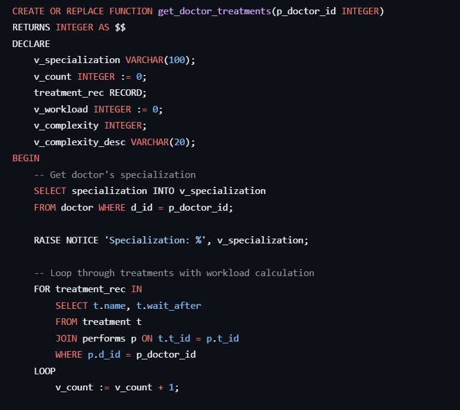 
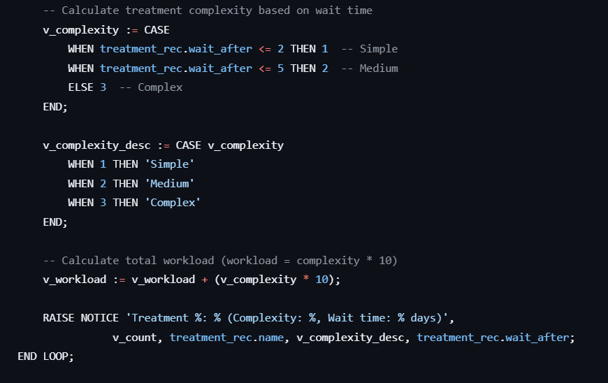 
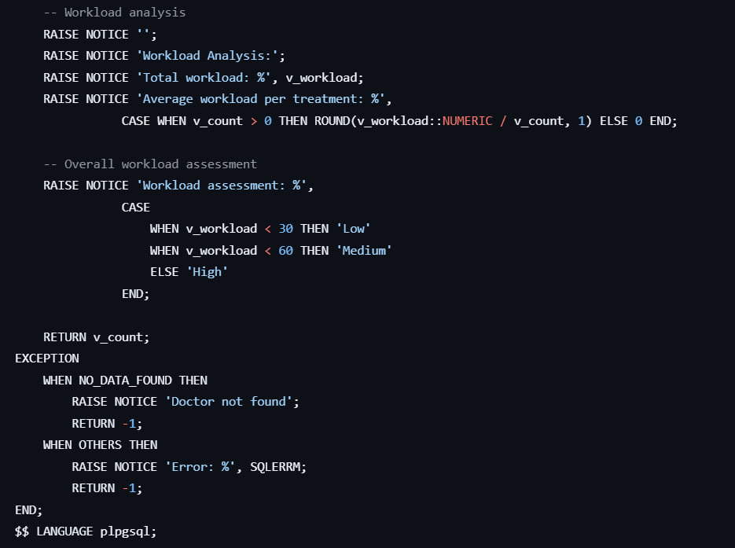 

## פרוצדורה 1

הפרוצדורה assign_volunteer_to_patient_new משמשת לשיוך מתנדב למטופל באופן בטוח. היא מקבלת מזהי מתנדב ומטופל, בודקת אם שניהם קיימים במערכת, ואם המתנדב כבר משויך למטופל. במידה והשיוך טרם קיים – מתבצע INSERT לטבלת הקשרים volunteerfor. נעשה שימוש בבדיקות קיום עם IF NOT EXISTS, בשאילתת SELECT INTO, בטיפול בשגיאות (EXCEPTION) כולל הפרות של מפתחות זרים או ייחודיים, וב־RAISE NOTICE לצורך תיעוד פעולות ושלבי ביניים.

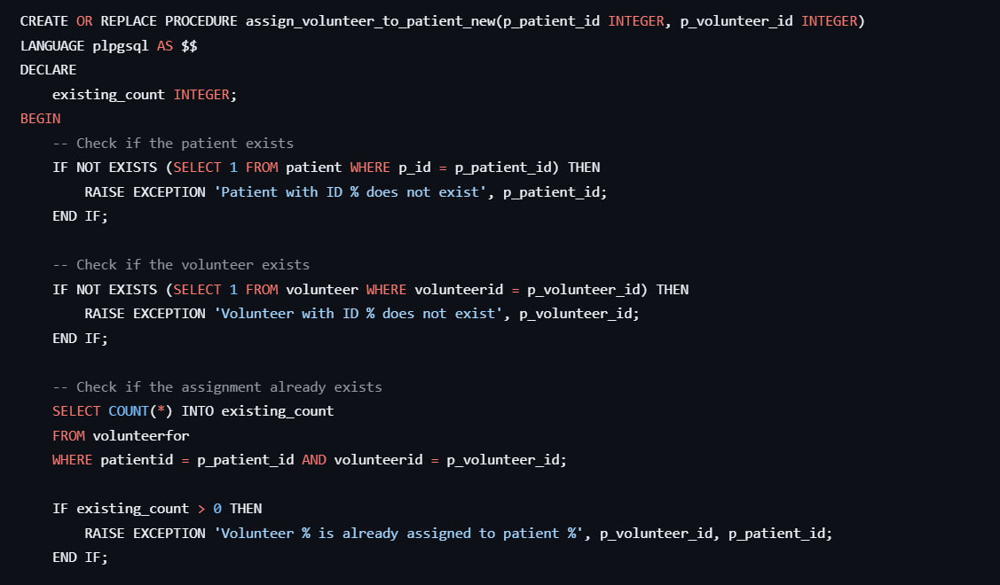 
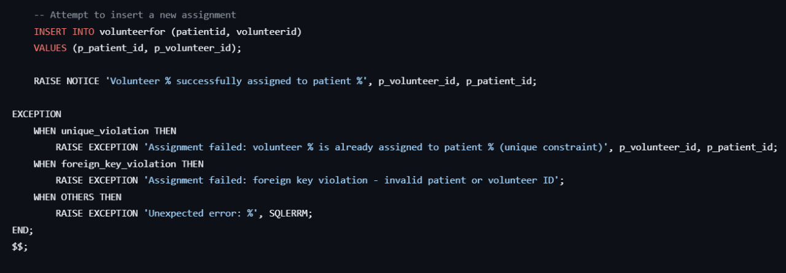 

## פרוצדורה 2

הפרוצדורה update_nurse_shift_new מעדכנת את משמרת האחות לפי מספר טלפון, ומשייכת את מטופליה לאחיות אחרות בהתאם למשמרת החדשה. נעשה שימוש ב־SELECT INTO לשליפת נתוני אחות, בלולאת FOR על מטופלים, וב־RECORD לשמירת נתוני ביניים. בנוסף, יש שימוש בתנאים (IF, IF NOT EXISTS) למציאת אחות חלופית וביצוע INSERT לרישום בדיקה חדשה. לבסוף, מתבצע UPDATE למשמרת האחות המקורית. תהליך העבודה מתועד עם RAISE NOTICE, וכולל טיפול בשגיאות דרך EXCEPTION, כולל ROLLBACK במקרה הצורך.

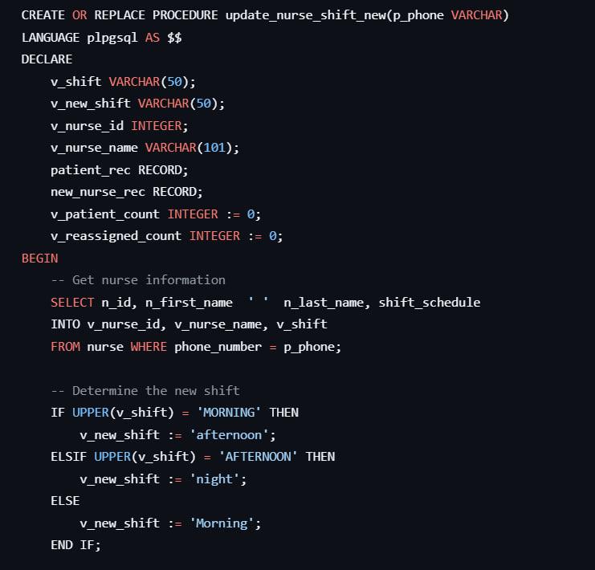 
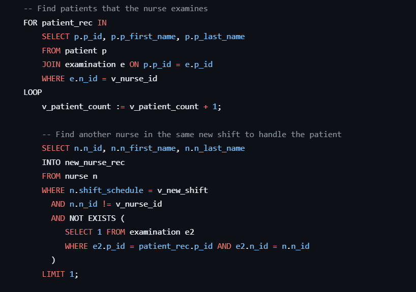 
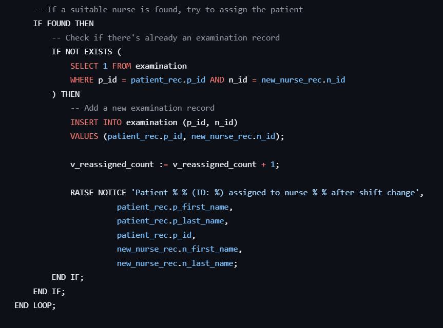 
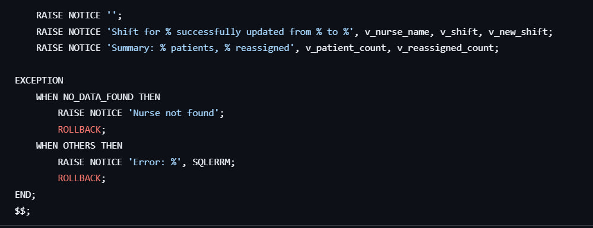 

## טריגר 1

הטריגר update_patient_volunteers_count מופעל לאחר הוספה או מחיקה מטבלת volunteerfor, ומפעיל את הפונקציה update_patient_volunteers_count_func. הפונקציה מחשבת את מספר המתנדבים המשויכים למטופל באמצעות שאילתת SELECT COUNT(*), בהתאם לפעולה (INSERT או DELETE). נעשה שימוש במשתנה v_count ובפקודת RAISE NOTICE להצגת עדכון בזמן אמת. הפונקציה מחזירה NULL מאחר והיא מיועדת רק להצגת מידע ואינה משנה את הנתונים.

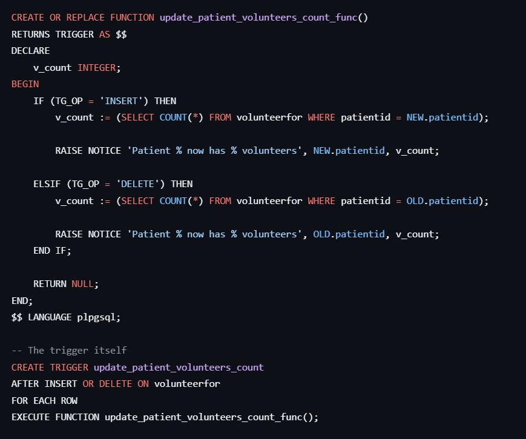 

## טריגר 2

הטריגר monitor_nurse_shift_changes מופעל לאחר עדכון העמודה shift_schedule בטבלת nurse, ומפעיל את הפונקציה monitor_nurse_shift_changes_func. הפונקציה מדפיסה הודעת RAISE NOTICE עם פרטי האחות והשינוי שבוצע במשמרת. לאחר מכן, מבוצעת בדיקת כמות האחיות שנותרו במשמרת הישנה באמצעות SELECT COUNT(*), ואם המספר קטן מ־120 – מוצגת אזהרה. הפונקציה מחזירה את הרשומה המעודכנת (RETURN NEW) לצורך שמירת השינוי.

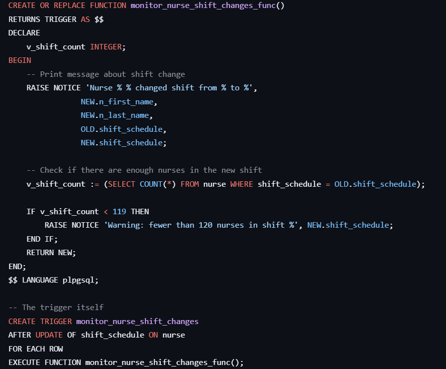 

## תוכנית ראשית 1

בתחילה, נפתח קורסור בשם vol_cursor באמצעות הפונקציה get_volunteer_info, המקבלת כתובת אימייל, עמודת מיון (date) וסדר (DESC).
לאחר מכן, מתבצעת לולאת FETCH בה כל שורה שנשלפת מקורסור מנותחת לשדות type, name ו־date, ומודפסת עם RAISE NOTICE.
בסיום הלולאה הקורסור נסגר עם CLOSE. לבסוף, מתבצעת קריאה לפרוצדורה assign_volunteer_to_patient_new שמבצעת השמה של מתנדב למטופל בהתאם למזהים שנמסרו.
ניתן לראות שהתוכנית הראשית מזמנת את הפונקציה get_volunteer_info ששולפת את הנתונים על המתנדב, ולאחר מכן התוכנית הראשית מזמנת את הפרוצדורה assign_volunteer_to_patient_new שמוסיפה את ההקצאה של מטופל ומתנדב לטבלה המיועדת בבסיס הנתונים.

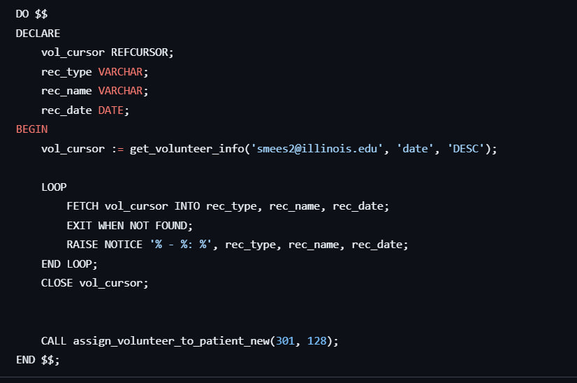

נראה שההקצאה אכן עבדה:

לפני הרצת התוכנית הראשית:
ניתן לראות שאין בטבלה הקצאה של המטופל 301 ושל המתנדב 128
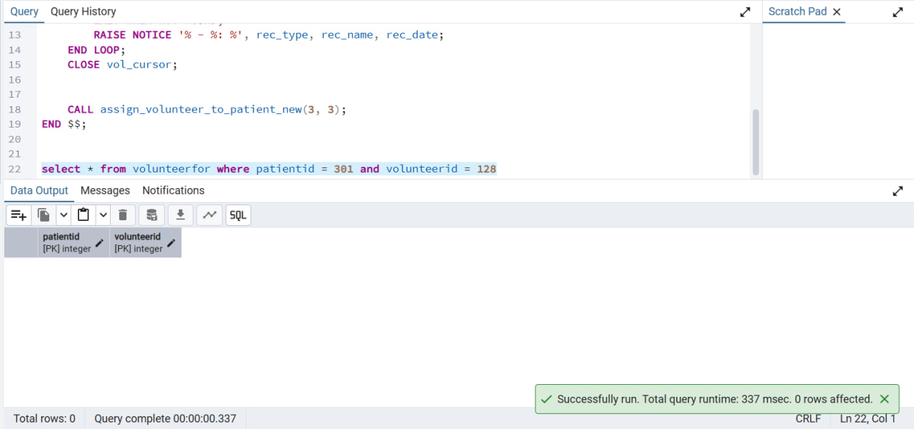 

הרצת התוכנית:
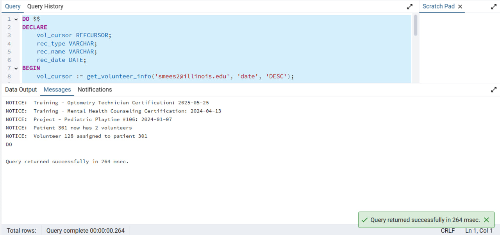 

לאחר הרצת התוכנית:
ניתן לראות שההקצאה של המטופל והמתנדב אכן עבדה.

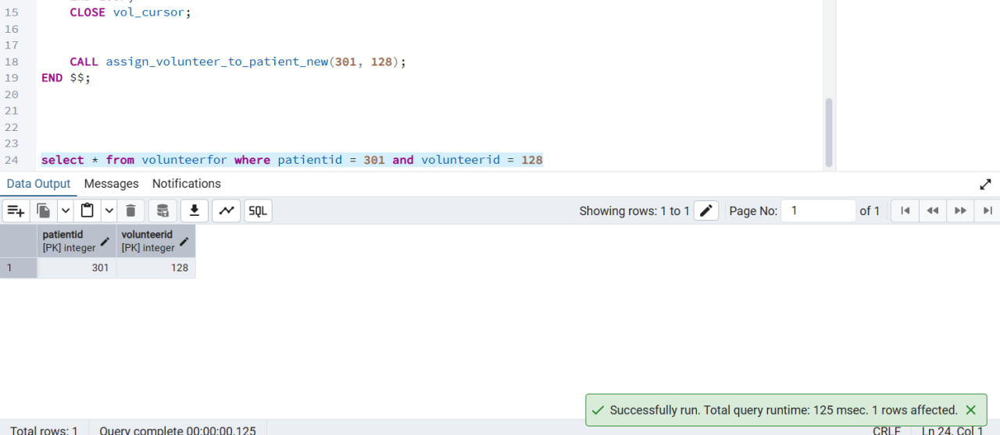 

## תוכנית ראשית 2

תחילה הוא שומר במשתנה treatment_count את מספר הטיפולים שביצע רופא מסוים באמצעות הפונקציה get_doctor_treatments, כאשר המזהה של הרופא הוא 520. לאחר מכן מדפיס את המספר בעזרת RAISE NOTICE.
לאחר ההפרדה בשורה ריקה, מתבצעת קריאה לפרוצדורה update_nurse_shift_new, אשר מעדכנת את המשמרת של אחות לפי מספר טלפון (במקרה זה: '1234119289'), ומבצעת טיפול מחדש בהשמות של מטופלים לפי הצורך בהתאם לשינוי המשמרת.

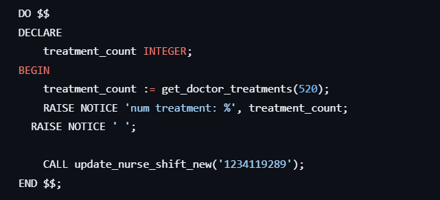 

לפני הרצת התוכנית:
ניתן לראות שהאחות משובצת למשמרת צהרים

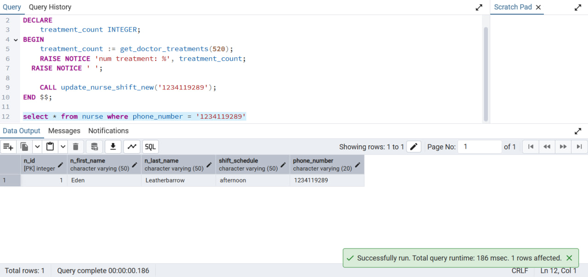 

הרצת התוכנית:
ניתן לראות שיש הדפסה של כל הנתונים המבוקשים וגם מופעל הטריגר כי יש פחות מ119 אחיות במשמרת.
 
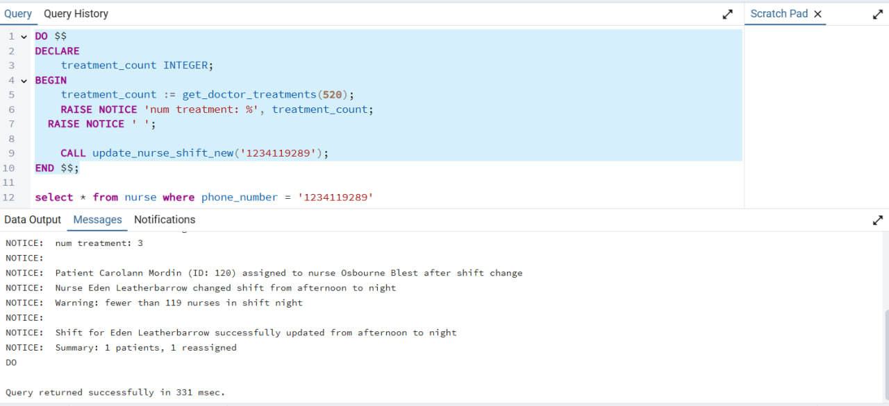 

לאחר הרצת התוכנית:
ניתן לראות שהאחות משובצת למשמרת לילה כנדרש

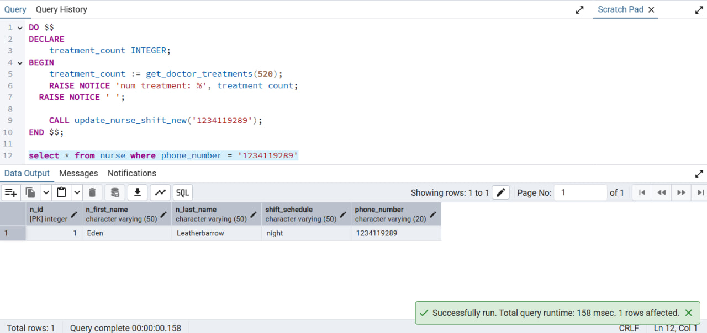 

## שלב ה -  יצירת ממשק גרפי לעבודה מול בסיס הנתונים  

## הסבר מפורט על הפרויקט והטכנולוגיות
פרויקט "מערכת ניהול בית חולים" הוא פתרון טכנולוגי מקיף שפותח כדי לענות על הצרכים המורכבים של ניהול בית חולים מודרני. המערכת מטפלת בניהול משאבי אנוש רפואיים, מעקב אחר מטופלים, תיאום פעילויות התנדבות, וביצוע אנליזות מתקדמות לשיפור היעילות התפעולית.
ליבת המערכת ופונקציונליות

המערכת מספקת ממשק משולב לניהול ארבעת הישויות העיקריות בבית החולים: רופאים עם פרטי התמחות וניהול עומס עבודה, מטופלים כולל שיבוץ למיטות וחדרים, מתנדבים עם סיווג לפי כישורים וסוגי פעילות, ושיבוצים דינמיים בין מתנדבים למטופלים. כל ישות כוללת פונקציונליות CRUD מלאה (יצירה, קריאה, עדכון, מחיקה) עם חיפוש מתקדם לפי מזהים ייחודיים. המערכת כוללת גם מודול שאילתות מיוחד המאפשר ביצוע אנליזות כמו מעקב אחר מיטות פנויות לפי חדרים וזיהוי תקופות עומס בדיווח רפואי.
ארכיטקטורת Backend מתקדמת

השרת בנוי על מסגרת Flask שנבחרה בזכות גמישותה וקלות הפיתוח. Flask מאפשר יצירת API RESTful מובנה עם נתיבים (routes) ברורים לכל פעולה, טיפול יעיל בבקשות HTTP, וניהול שגיאות מתוחכם. השרת מממש שכבת לוגיקה עסקית מורכבת הכוללת ולידציות נתונים מרובות שכבות, חישובי עומס עבודה לרופאים, וניהול אוטומטי של שיבוצי מיטות. השימוש ב-psycopg2 כדרייבר PostgreSQL מבטיח ביצועים גבוהים וטיפול בטוח בנתונים עם הגנה מפני SQL injection ותמיכה בטרנזקציות מורכבות.
בסיס נתונים מתקדם ופונקציונליות מאוחסנת

צד לקוח מתקדם ואינטראקטיבי
החזית הקדמית בנויה על טכנולוגיות ווב מודרניות ללא תלות בספריות חיצוניות. HTML5 מספק מבנה סמנטי נקי עם תמיכה בנגישות ו-SEO, CSS3 מממש עיצוב רספונסיבי מתקדם עם Flexbox ו-Grid לפריסה דינמית, אנימציות חלקות, ותמיכה במכשירים שונים. JavaScript הטהור מנהל את כל האינטראקטיביות כולל טעינה דינמית של תוכן, בקשות AJAX אסינכרוניות לשרת, ולידציות בזמן אמת, וניהול מצב אפליקציה מורכב. הממשק כולל מודאלים אינטראקטיביים לעריכת נתונים, טבלאות דינמיות עם חיפוש מהיר, והודעות משתמש אלגנטיות.

## הוראות הפעלה
שלב 1 - הכנת הפרויקט
mkdir hospital_management

cd hospital_management

python -m venv venv

# הפעלת הסביבה הוירטואלית
venv\Scripts\activate        # Windows

source venv/bin/activate     # Linux/Mac

pip install flask psycopg2-binary python-dotenv

שלב 2 - הגדרת PostgreSQL 
docker run --name hospital-postgres \

  -e POSTGRES_DB=hospital_db \
  
  -e POSTGRES_USER=hospital_user \
  
  -e POSTGRES_PASSWORD=hospital_pass \
  
  -p 5432:5432 -d postgres:13

שלב 3 - יצירת קובץ .env
DB_HOST=localhost

DB_PORT=5432

DB_NAME=hospital_db

DB_USER=hospital_user

DB_PASSWORD=hospital_pass

שלב 4 - יצירת מבנה קבצים
hospital_management/

├── app.py

├── db.py

├── .env

├── static/css/style.css

├── static/js/main.js

└── templates/index.html

שלב 5 - יצירת הטבלאות

התחבר לבסיס הנתונים

הרץ את הסקריפט db.sql

שלב 6 - הפעלת האפליקציה

להריץ python app.py 

להיכנס לקישור שמופיע: http://localhost:5000

## תמונות מסך של האפליקציה

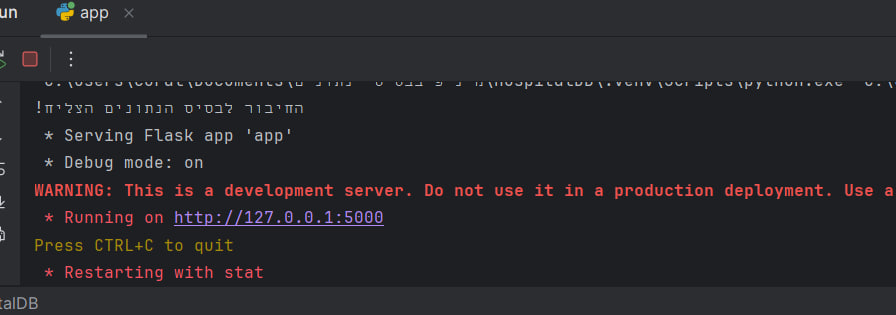 
