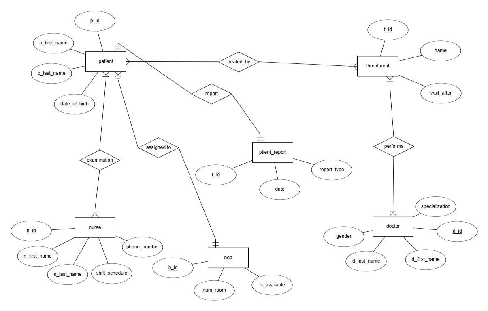
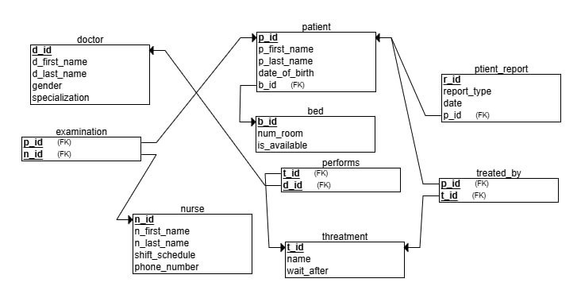
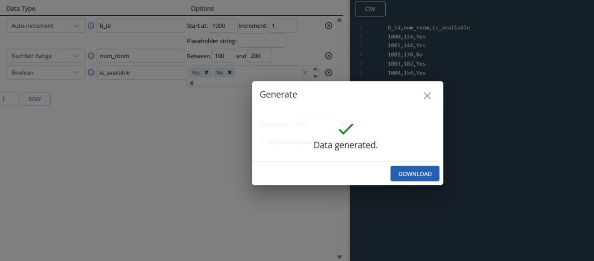
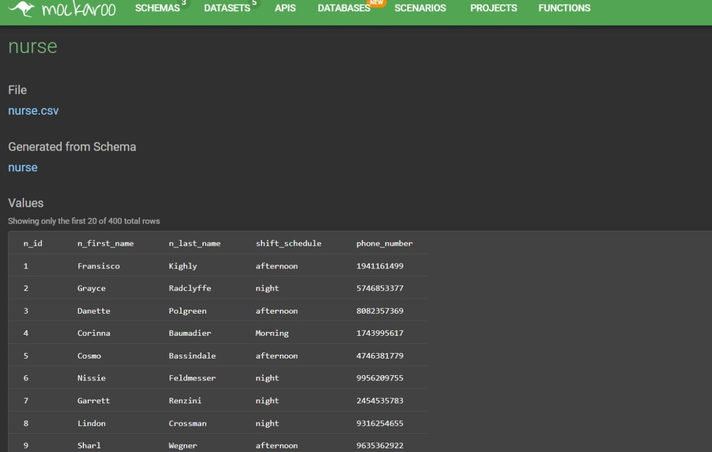
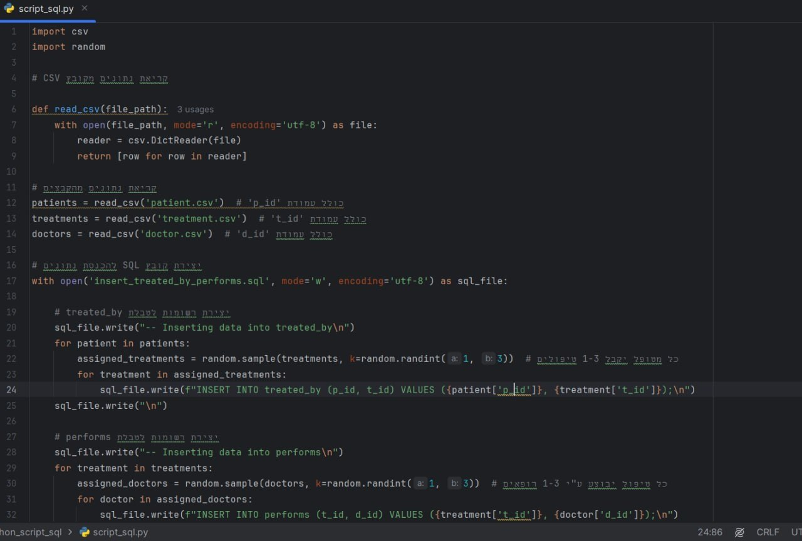
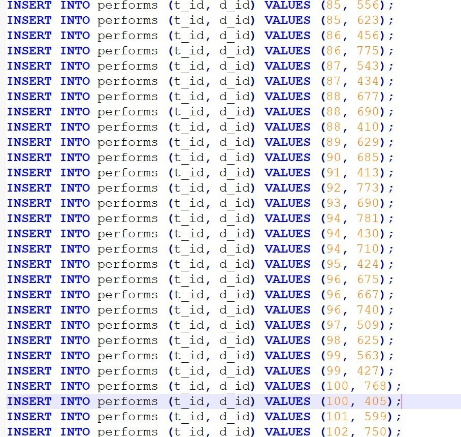
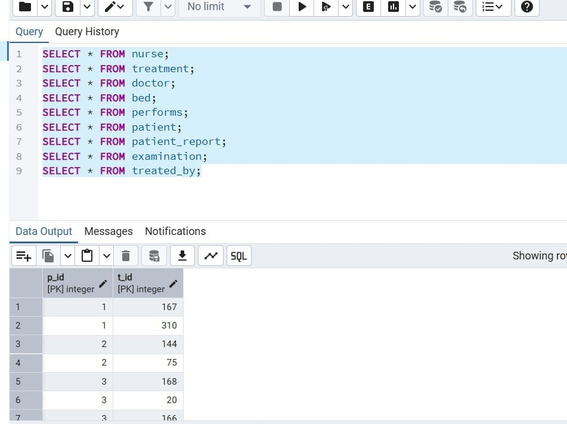
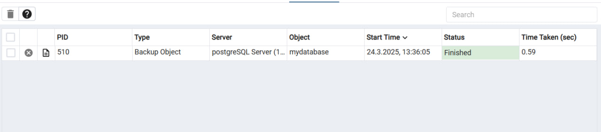
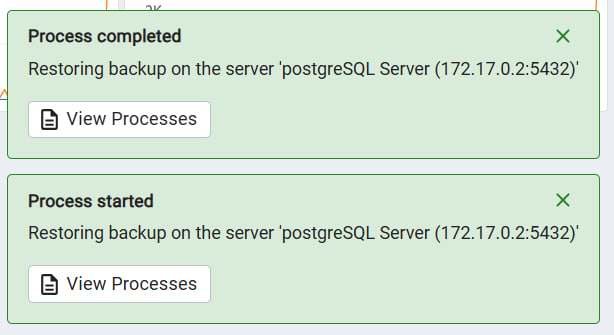
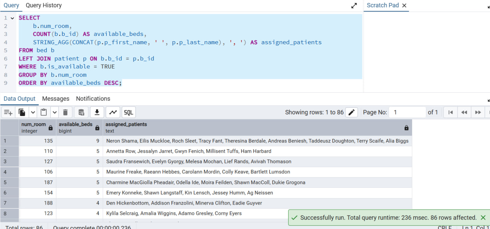

# פרויקט בבסיסי נתונים - בית החולים תל השומר, מחלקת מיון

## מגישות
- קורל שמואלוביץ
- טלאל הלוי

  ## שלב א - עיצוב ויצירת בסיס הנתונים, והכנסת הנתונים

## תיאור הארגון

בית החולים תל השומר הוא אחד מבתי החולים הגדולים והמובילים בישראל, הכולל מגוון מחלקות רפואיות, ביניהן מחלקת מיון (חדר מיון), האחראית על קבלת מטופלים הדורשים טיפול רפואי דחוף.

המערכת לניהול מחלקת המיון בבית החולים תל השומר כוללת נתונים על מטופלים המגיעים למיון, על רופאים, אחיות, טיפולים, דוחות רפואיים, ומיטות המוקצות למטופלים.

המערכת מאפשרת מספר דברים מרכזיים:
• רישום מטופלים חדשים כולל פרטים אישיים
• שיוך מטופלים לרופאים ולאחיות בהתאם לתחום ההתמחות והזמינות.
• ניהול הטיפולים והבדיקות הרפואיות שהמטופל עובר במהלך שהותו במיון.
• יצירת דוחות רפואיים.
• הקצאת מיטות זמינות למטופלים בהתאם.
ועוד.
המערכת תומכת בשיפור היעילות התפעולית של מחלקת המיון, ומייעלת את תהליך קבלת ההחלטות הקליניות.

## דיאגרמת ERD:

## הסבר על הישויות והקשרים

התרשים (ERD - Entity-Relationship Diagram) מתאר את מבנה מסד הנתונים של מחלקת המיון בבית החולים, כולל הישויות העיקריות והקשרים ביניהן.

רופא (Doctor) – מאחסן פרטי רופאים, כולל שם פרטי, שם משפחה, מגדר והתמחות רפואית. הרופאים אחראים על ביצוע טיפולים.

אחות (Nurse) – מכיל מידע על האחיות, כולל שם, לוח משמרות ומספר טלפון.

מטופל (Patient) – מתאר את פרטי המטופלים, כולל שם, תאריך לידה ומספר מיטה (אם מוקצה להם).

מיטה (Bed) – מייצגת מיטות במחלקה, עם נתונים על מספר החדר וזמינות המיטה.

טיפול (Treatment) – מכיל מידע על סוגי הטיפולים הזמינים, כולל שם הטיפול וזמן המתנה נדרש לאחריו.

דוח מטופל (Patient Report) – מאחסן דוחות רפואיים של מטופלים, כולל סוג הדוח, תאריך ושיוך למטופל.

בדיקה (Examination) – מתעדת את הבדיקות שהמטופלים עוברים אצל האחיות.

ביצוע טיפול (Performs) – מתאר את הקשר בין רופאים לטיפולים שהם מבצעים.

טופל על ידי (Treated By) – מקשר בין מטופלים לטיפולים שהם עברו.

## תרשים DSD:

## יצירת הטבלאות:
CREATE TABLE nurse (

  n_id INT PRIMARY KEY NOT NULL,
  
  n_first_name VARCHAR(50) NOT NULL,
  
  n_last_name VARCHAR(50) NOT NULL,
  
  shift_schedule VARCHAR(50) NOT NULL,
  
  phone_number VARCHAR(20) NOT NULL
  
);

CREATE TABLE treatment (

  t_id INT PRIMARY KEY NOT NULL,
  
  name VARCHAR(100) NOT NULL,
  
  wait_after INT NOT NULL
  
);

CREATE TABLE doctor (

  d_id INT PRIMARY KEY NOT NULL,
  
  d_first_name VARCHAR(50) NOT NULL,
  
  d_last_name VARCHAR(50) NOT NULL,
  
  gender VARCHAR(10) NOT NULL,
  
  specialization VARCHAR(100) NOT NULL
  
);

CREATE TABLE bed (

  b_id INT PRIMARY KEY NOT NULL,
  
  num_room INT NOT NULL,
  
  is_available BOOLEAN NOT NULL
  
);

CREATE TABLE performs (

  t_id INT NOT NULL,
  
  d_id INT NOT NULL,
  
  PRIMARY KEY (t_id, d_id),
  
  FOREIGN KEY (t_id) REFERENCES treatment(t_id),
  
  FOREIGN KEY (d_id) REFERENCES doctor(d_id)
  
);

CREATE TABLE patient (

  p_id INT PRIMARY KEY NOT NULL,
  
  p_first_name VARCHAR(50) NOT NULL,
  
  p_last_name VARCHAR(50) NOT NULL,
  
  date_of_birth DATE NOT NULL,
  
  b_id INT NOT NULL,
  
  FOREIGN KEY (b_id) REFERENCES bed(b_id)
  
);

CREATE TABLE patient_report (

  r_id INT PRIMARY KEY NOT NULL,
  
  report_type VARCHAR(50) NOT NULL,
  
  report_date DATE NOT NULL,
  
  p_id INT NOT NULL,
  
  FOREIGN KEY (p_id) REFERENCES patient(p_id)
  
);

CREATE TABLE examination (

  p_id INT NOT NULL,
  
  n_id INT NOT NULL,
  
  PRIMARY KEY (p_id, n_id),
  
  FOREIGN KEY (p_id) REFERENCES patient(p_id),
  
  FOREIGN KEY (n_id) REFERENCES nurse(n_id)
  
);

CREATE TABLE treated_by (

  p_id INT NOT NULL,
  
  t_id INT NOT NULL,
  
  PRIMARY KEY (p_id, t_id),
  
  FOREIGN KEY (p_id) REFERENCES patient(p_id),
  
  FOREIGN KEY (t_id) REFERENCES treatment(t_id)
  
);

## הכנסת הנתונים ב3 שיטות

## דרך Generate Data:

## דרך Mockaroo:

## דרך סקריפט בפייתון:

## נריץ על מנת לקבל את הנתונים:

## גיבוי ושחזור הנתונים
## גיבוי הנתונים:

# שחזור הנתונים:

  ## שלב ב - כתיבת שאילתות ואילוצים

  ## יצירת שאילתות DELETE:

  ## 1. חדרים וכמות המיטות הפנויות בכל חדר
שאילתה זו מציגה את מספר המיטות הפנויות בכל חדר בבית החולים, יחד עם רשימת המטופלים ששויכו למיטות הפנויות הללו. 

היא מבוססת על הצטרפות בין טבלת המיטות והמטופלים, כאשר מוצגים רק המיטות שסומנו כ"זמינות".

כך ניתן לקבל תמונת מצב עדכנית לגבי זמינות המקום בכל חדר – מידע חיוני לניהול עומסים ולאשפוזים עתידיים.
  
