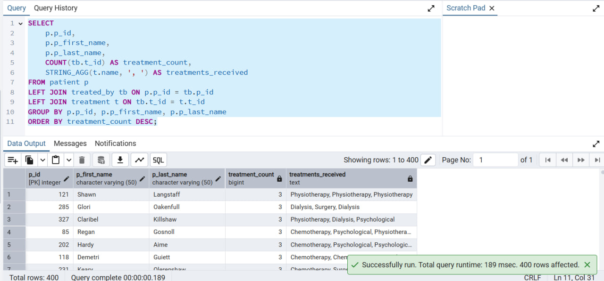

# פרויקט בבסיסי נתונים - בית החולים תל השומר, מחלקת מיון

## מגישות
- קורל שמואלוביץ
- טלאל הלוי

  ## שלב א - עיצוב ויצירת בסיס הנתונים, והכנסת הנתונים

## תיאור הארגון

בית החולים תל השומר הוא אחד מבתי החולים הגדולים והמובילים בישראל, הכולל מגוון מחלקות רפואיות, ביניהן מחלקת מיון (חדר מיון), האחראית על קבלת מטופלים הדורשים טיפול רפואי דחוף.

המערכת לניהול מחלקת המיון בבית החולים תל השומר כוללת נתונים על מטופלים המגיעים למיון, על רופאים, אחיות, טיפולים, דוחות רפואיים, ומיטות המוקצות למטופלים.

המערכת מאפשרת מספר דברים מרכזיים:
• רישום מטופלים חדשים כולל פרטים אישיים
• שיוך מטופלים לרופאים ולאחיות בהתאם לתחום ההתמחות והזמינות.
• ניהול הטיפולים והבדיקות הרפואיות שהמטופל עובר במהלך שהותו במיון.
• יצירת דוחות רפואיים.
• הקצאת מיטות זמינות למטופלים בהתאם.
ועוד.
המערכת תומכת בשיפור היעילות התפעולית של מחלקת המיון, ומייעלת את תהליך קבלת ההחלטות הקליניות.

## דיאגרמת ERD:

## הסבר על הישויות והקשרים

התרשים (ERD - Entity-Relationship Diagram) מתאר את מבנה מסד הנתונים של מחלקת המיון בבית החולים, כולל הישויות העיקריות והקשרים ביניהן.

רופא (Doctor) – מאחסן פרטי רופאים, כולל שם פרטי, שם משפחה, מגדר והתמחות רפואית. הרופאים אחראים על ביצוע טיפולים.

אחות (Nurse) – מכיל מידע על האחיות, כולל שם, לוח משמרות ומספר טלפון.

מטופל (Patient) – מתאר את פרטי המטופלים, כולל שם, תאריך לידה ומספר מיטה (אם מוקצה להם).

מיטה (Bed) – מייצגת מיטות במחלקה, עם נתונים על מספר החדר וזמינות המיטה.

טיפול (Treatment) – מכיל מידע על סוגי הטיפולים הזמינים, כולל שם הטיפול וזמן המתנה נדרש לאחריו.

דוח מטופל (Patient Report) – מאחסן דוחות רפואיים של מטופלים, כולל סוג הדוח, תאריך ושיוך למטופל.

בדיקה (Examination) – מתעדת את הבדיקות שהמטופלים עוברים אצל האחיות.

ביצוע טיפול (Performs) – מתאר את הקשר בין רופאים לטיפולים שהם מבצעים.

טופל על ידי (Treated By) – מקשר בין מטופלים לטיפולים שהם עברו.

## תרשים DSD:

## יצירת הטבלאות:
CREATE TABLE nurse (

  n_id INT PRIMARY KEY NOT NULL,
  
  n_first_name VARCHAR(50) NOT NULL,
  
  n_last_name VARCHAR(50) NOT NULL,
  
  shift_schedule VARCHAR(50) NOT NULL,
  
  phone_number VARCHAR(20) NOT NULL
  
);

CREATE TABLE treatment (

  t_id INT PRIMARY KEY NOT NULL,
  
  name VARCHAR(100) NOT NULL,
  
  wait_after INT NOT NULL
  
);

CREATE TABLE doctor (

  d_id INT PRIMARY KEY NOT NULL,
  
  d_first_name VARCHAR(50) NOT NULL,
  
  d_last_name VARCHAR(50) NOT NULL,
  
  gender VARCHAR(10) NOT NULL,
  
  specialization VARCHAR(100) NOT NULL
  
);

CREATE TABLE bed (

  b_id INT PRIMARY KEY NOT NULL,
  
  num_room INT NOT NULL,
  
  is_available BOOLEAN NOT NULL
  
);

CREATE TABLE performs (

  t_id INT NOT NULL,
  
  d_id INT NOT NULL,
  
  PRIMARY KEY (t_id, d_id),
  
  FOREIGN KEY (t_id) REFERENCES treatment(t_id),
  
  FOREIGN KEY (d_id) REFERENCES doctor(d_id)
  
);

CREATE TABLE patient (

  p_id INT PRIMARY KEY NOT NULL,
  
  p_first_name VARCHAR(50) NOT NULL,
  
  p_last_name VARCHAR(50) NOT NULL,
  
  date_of_birth DATE NOT NULL,
  
  b_id INT NOT NULL,
  
  FOREIGN KEY (b_id) REFERENCES bed(b_id)
  
);

CREATE TABLE patient_report (

  r_id INT PRIMARY KEY NOT NULL,
  
  report_type VARCHAR(50) NOT NULL,
  
  report_date DATE NOT NULL,
  
  p_id INT NOT NULL,
  
  FOREIGN KEY (p_id) REFERENCES patient(p_id)
  
);

CREATE TABLE examination (

  p_id INT NOT NULL,
  
  n_id INT NOT NULL,
  
  PRIMARY KEY (p_id, n_id),
  
  FOREIGN KEY (p_id) REFERENCES patient(p_id),
  
  FOREIGN KEY (n_id) REFERENCES nurse(n_id)
  
);

CREATE TABLE treated_by (

  p_id INT NOT NULL,
  
  t_id INT NOT NULL,
  
  PRIMARY KEY (p_id, t_id),
  
  FOREIGN KEY (p_id) REFERENCES patient(p_id),
  
  FOREIGN KEY (t_id) REFERENCES treatment(t_id)
  
);

## הכנסת הנתונים ב3 שיטות

## דרך Generate Data:

## דרך Mockaroo:

## דרך סקריפט בפייתון:

## נריץ על מנת לקבל את הנתונים:

## גיבוי ושחזור הנתונים
## גיבוי הנתונים:

# שחזור הנתונים:

  ## שלב ב - כתיבת שאילתות ואילוצים

  ## יצירת שאילתות SELECT:

  ## 1. חדרים וכמות המיטות הפנויות בכל חדר
שאילתה זו מציגה את מספר המיטות הפנויות בכל חדר בבית החולים, וכן את שמות המטופלים ששויכו למיטות אלו. המידע נאסף מטבלת bed, כאשר אנו משתמשים ב־LEFT JOIN לטבלת patient כדי לאפשר הצגת מיטות גם אם הן אינן מוקצות למטופלים. 

הסינון מתבצע באמצעות התנאי b.is_available = TRUE על מנת לכלול רק מיטות פנויות. מספר המיטות מחושב באמצעות הפונקציה COUNT, ושמות המטופלים מאוחדים בעזרת STRING_AGG. הנתונים מקובצים לפי מספר החדר (GROUP BY b.num_room) וממוינים 

לפי כמות המיטות הפנויות בסדר יורד.

  

## 2. רופאים ומספר הטיפולים שביצעו לפי התמחות
שאילתה זו נועדה להציג את חמשת הרופאים שביצעו את מספר הטיפולים הגבוה ביותר, תוך הצגת שמם, שם משפחתם, תחום ההתמחות שלהם, וכמות הטיפולים הכוללת. 

נעשה שימוש ב־LEFT JOIN בין הטבלאות doctor ו־performs, המייצגת את פעולות הרופאים. ספירת הטיפולים נעשית באמצעות COUNT, הנתונים מקובצים לפי מאפייני הרופא, וממוינים בסדר יורד לפי מספר הטיפולים. בסיום, 

מופיעים רק חמישה רופאים באמצעות LIMIT 5.

  

  ## 3. מטופלים שאושפזו וקיבלו טיפול כירורגי
שאילתה זו מאתרת מטופלים שהיו באשפוז (על סמך דוח מסוג 'Hospitalization') וקיבלו טיפול כירורגי (שמו 'Surgery'). היא מציגה את שם המטופל, גילו (חישוב באמצעות AGE), 

תאריך הדוח, שם הטיפול, ומידע על החדר והמיטה. השאילתה משתמשת במספר JOIN-ים בין הטבלאות patient, patient_report, treated_by, treatment ו־bed.

בנוסף, יש שימוש בתת־שאילתה פנימית שמחזירה את תאריך הדוח של כל מטופל.

  
  

## 4. החודש עם הכי הרבה דוחות בכל שנה בעשור האחרון
שאילתה זו נועדה לאתר בכל שנה בעשור האחרון את החודש שבו נרשמה כמות הדוחות הגבוהה ביותר. המידע מבוסס על טבלת patient_report, וכולל שימוש ב־EXTRACT להוצאת שנה וחודש מתוך תאריך הדוח. 

נעשה שימוש ב־RANK() (פונקציית חלון) כדי לדרג את החודשים לפי מספר הדוחות בכל שנה, ולאחר מכן מסוננים רק החודשים המדורגים במקום הראשון בכל שנה (WHERE rnk = 1).

תוצאה זו מאפשרת לזהות תקופות שיא בפעילות הדיווח הרפואי.

  

  ## 5. חמישה המטופלים שקיבלו הכי הרבה טיפולים (נולדו אחרי 2020)
שאילתה זו מציגה את חמשת המטופלים שנולדו בשנת 2020 ואילך (כלומר עד גיל 5), שקיבלו את מספר הטיפולים הרב ביותר. היא עושה שימוש ב־JOIN בין patient, treated_by ו־treatment, ובאמצעות COUNT סופרת את הטיפולים לכל מטופל.

תנאי הסינון מתבצע על פי השנה מתוך date_of_birth, והנתונים מקובצים לפי פרטי המטופל.

לבסוף, הנתונים ממוינים בסדר יורד ומוגבלים לחמישה מטופלים באמצעות LIMIT 5.

  

 ## 6. חמישה רופאים שביצעו יותר טיפולים מהממוצע הכללי
מטרת השאילתה היא להציג חמישה רופאים שביצעו יותר טיפולים מהממוצע הכללי של כלל הרופאים. נעשה שימוש ב־JOIN בין doctor ל־performs, יחד עם GROUP BY לפי מזהה הרופא.

תנאי הסינון ב־HAVING מבצע השוואה בין כמות הטיפולים של כל רופא לבין ממוצע כלל הרופאים, שנחושב בתת־שאילתה פנימית באמצעות AVG ו־GROUP BY. 

כך ניתן לזהות את הרופאים הבולטים ביותר מבחינת פעילות.

  

 ## 7. שלושת האחיות (אחת מכל משמרת) שביצעו הכי הרבה טיפולים
שאילתה זו מציגה את האחות שביצעה הכי הרבה טיפולים בכל משמרת (בוקר, ערב ולילה).

תחילה נבנית שאילתה עם פונקציית דירוג ROW_NUMBER() שמדרגת את האחיות לפי כמות הבדיקות שביצעו, תוך חלוקה לפי shift_schedule.

החיבור בין הטבלאות nurse, examination, ו־treated_by מאפשר לספור כמה טיפולים נקשרו לכל אחות דרך בדיקות. לבסוף, מסוננות רק האחיות שהן במקום הראשון בכל משמרת (WHERE rn = 1), ומוצגים פרטיהן כולל מספר הטלפון.

 

## 8. מטופלים עם מספר טיפולים שקיבלו וסוג הטיפולים
שאילתה זו מחזירה רשימה של מטופלים, כמה טיפולים קיבלו, ואילו סוגי טיפולים עברו.

נעשה שימוש ב־LEFT JOIN בין patient, treated_by ו־treatment, כדי לוודא שגם מטופלים שלא עברו טיפול יופיעו (אם נדרש). הספירה נעשית עם COUNT, וסוגי הטיפולים מאוחדים בעזרת STRING_AGG לשדה אחד.

הנתונים מקובצים לפי המטופלים וממוינים לפי מספר הטיפולים בסדר יורד, מה שמאפשר זיהוי מטופלים עם היסטוריה רפואית עשירה או מורכבת.

 
