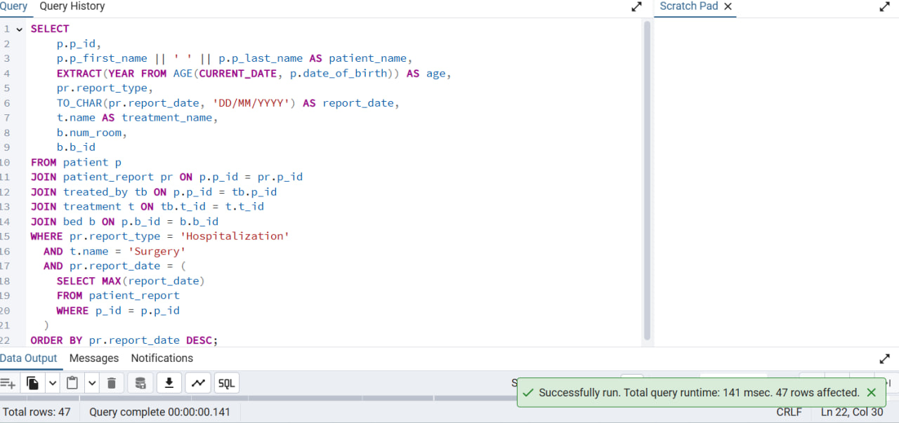
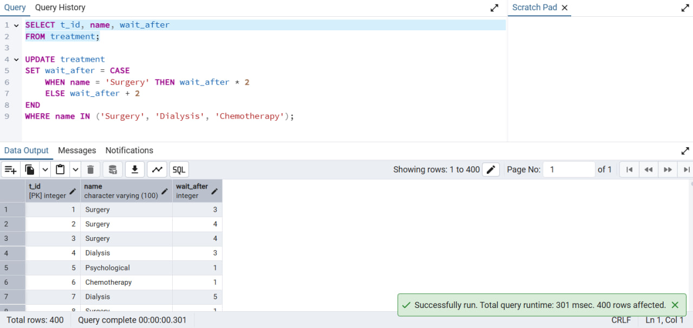
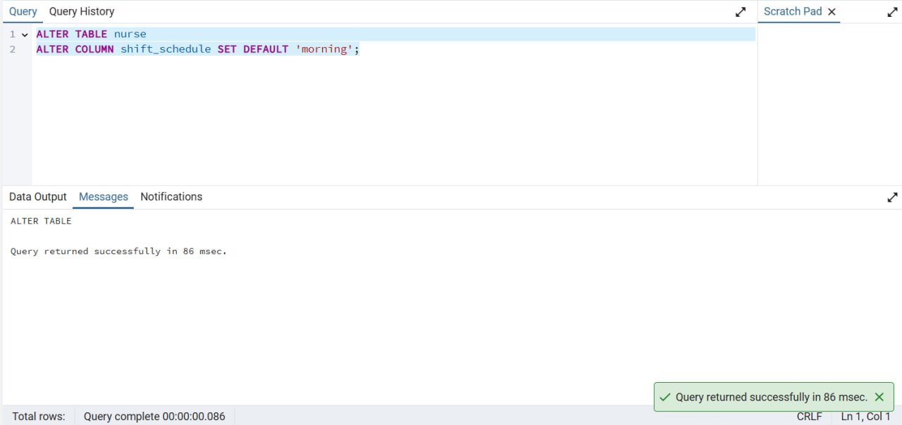
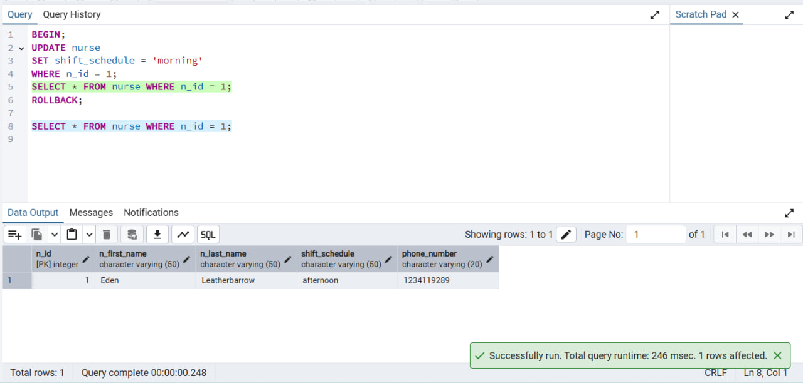

# פרויקט בבסיסי נתונים - בית החולים תל השומר, מחלקת מיון

## מגישות
- קורל שמואלוביץ
- טלאל הלוי

  ## שלב א - עיצוב ויצירת בסיס הנתונים, והכנסת הנתונים

## תיאור הארגון

בית החולים תל השומר הוא אחד מבתי החולים הגדולים והמובילים בישראל, הכולל מגוון מחלקות רפואיות, ביניהן מחלקת מיון (חדר מיון), האחראית על קבלת מטופלים הדורשים טיפול רפואי דחוף.

המערכת לניהול מחלקת המיון בבית החולים תל השומר כוללת נתונים על מטופלים המגיעים למיון, על רופאים, אחיות, טיפולים, דוחות רפואיים, ומיטות המוקצות למטופלים.

המערכת מאפשרת מספר דברים מרכזיים:
• רישום מטופלים חדשים כולל פרטים אישיים
• שיוך מטופלים לרופאים ולאחיות בהתאם לתחום ההתמחות והזמינות.
• ניהול הטיפולים והבדיקות הרפואיות שהמטופל עובר במהלך שהותו במיון.
• יצירת דוחות רפואיים.
• הקצאת מיטות זמינות למטופלים בהתאם.
ועוד.
המערכת תומכת בשיפור היעילות התפעולית של מחלקת המיון, ומייעלת את תהליך קבלת ההחלטות הקליניות.

## דיאגרמת ERD:

## הסבר על הישויות והקשרים

התרשים (ERD - Entity-Relationship Diagram) מתאר את מבנה מסד הנתונים של מחלקת המיון בבית החולים, כולל הישויות העיקריות והקשרים ביניהן.

רופא (Doctor) – מאחסן פרטי רופאים, כולל שם פרטי, שם משפחה, מגדר והתמחות רפואית. הרופאים אחראים על ביצוע טיפולים.

אחות (Nurse) – מכיל מידע על האחיות, כולל שם, לוח משמרות ומספר טלפון.

מטופל (Patient) – מתאר את פרטי המטופלים, כולל שם, תאריך לידה ומספר מיטה (אם מוקצה להם).

מיטה (Bed) – מייצגת מיטות במחלקה, עם נתונים על מספר החדר וזמינות המיטה.

טיפול (Treatment) – מכיל מידע על סוגי הטיפולים הזמינים, כולל שם הטיפול וזמן המתנה נדרש לאחריו.

דוח מטופל (Patient Report) – מאחסן דוחות רפואיים של מטופלים, כולל סוג הדוח, תאריך ושיוך למטופל.

בדיקה (Examination) – מתעדת את הבדיקות שהמטופלים עוברים אצל האחיות.

ביצוע טיפול (Performs) – מתאר את הקשר בין רופאים לטיפולים שהם מבצעים.

טופל על ידי (Treated By) – מקשר בין מטופלים לטיפולים שהם עברו.

## תרשים DSD:

## יצירת הטבלאות:
CREATE TABLE nurse (

  n_id INT PRIMARY KEY NOT NULL,
  
  n_first_name VARCHAR(50) NOT NULL,
  
  n_last_name VARCHAR(50) NOT NULL,
  
  shift_schedule VARCHAR(50) NOT NULL,
  
  phone_number VARCHAR(20) NOT NULL
  
);

CREATE TABLE treatment (

  t_id INT PRIMARY KEY NOT NULL,
  
  name VARCHAR(100) NOT NULL,
  
  wait_after INT NOT NULL
  
);

CREATE TABLE doctor (

  d_id INT PRIMARY KEY NOT NULL,
  
  d_first_name VARCHAR(50) NOT NULL,
  
  d_last_name VARCHAR(50) NOT NULL,
  
  gender VARCHAR(10) NOT NULL,
  
  specialization VARCHAR(100) NOT NULL
  
);

CREATE TABLE bed (

  b_id INT PRIMARY KEY NOT NULL,
  
  num_room INT NOT NULL,
  
  is_available BOOLEAN NOT NULL
  
);

CREATE TABLE performs (

  t_id INT NOT NULL,
  
  d_id INT NOT NULL,
  
  PRIMARY KEY (t_id, d_id),
  
  FOREIGN KEY (t_id) REFERENCES treatment(t_id),
  
  FOREIGN KEY (d_id) REFERENCES doctor(d_id)
  
);

CREATE TABLE patient (

  p_id INT PRIMARY KEY NOT NULL,
  
  p_first_name VARCHAR(50) NOT NULL,
  
  p_last_name VARCHAR(50) NOT NULL,
  
  date_of_birth DATE NOT NULL,
  
  b_id INT NOT NULL,
  
  FOREIGN KEY (b_id) REFERENCES bed(b_id)
  
);

CREATE TABLE patient_report (

  r_id INT PRIMARY KEY NOT NULL,
  
  report_type VARCHAR(50) NOT NULL,
  
  report_date DATE NOT NULL,
  
  p_id INT NOT NULL,
  
  FOREIGN KEY (p_id) REFERENCES patient(p_id)
  
);

CREATE TABLE examination (

  p_id INT NOT NULL,
  
  n_id INT NOT NULL,
  
  PRIMARY KEY (p_id, n_id),
  
  FOREIGN KEY (p_id) REFERENCES patient(p_id),
  
  FOREIGN KEY (n_id) REFERENCES nurse(n_id)
  
);

CREATE TABLE treated_by (

  p_id INT NOT NULL,
  
  t_id INT NOT NULL,
  
  PRIMARY KEY (p_id, t_id),
  
  FOREIGN KEY (p_id) REFERENCES patient(p_id),
  
  FOREIGN KEY (t_id) REFERENCES treatment(t_id)
  
);

## הכנסת הנתונים ב3 שיטות

## דרך Generate Data:

## דרך Mockaroo:

## דרך סקריפט בפייתון:

## נריץ על מנת לקבל את הנתונים:

## גיבוי ושחזור הנתונים
## גיבוי הנתונים:

# שחזור הנתונים:

  ## שלב ב - כתיבת שאילתות ואילוצים

  ## יצירת שאילתות SELECT:

  ## 1. חדרים וכמות המיטות הפנויות בכל חדר
שאילתה זו מציגה את מספר המיטות הפנויות בכל חדר בבית החולים, וכן את שמות המטופלים ששויכו למיטות אלו. המידע נאסף מטבלת bed, כאשר אנו משתמשים ב־LEFT JOIN לטבלת patient כדי לאפשר הצגת מיטות גם אם הן אינן מוקצות למטופלים. 

הסינון מתבצע באמצעות התנאי b.is_available = TRUE על מנת לכלול רק מיטות פנויות. מספר המיטות מחושב באמצעות הפונקציה COUNT, ושמות המטופלים מאוחדים בעזרת STRING_AGG. הנתונים מקובצים לפי מספר החדר (GROUP BY b.num_room) וממוינים 

לפי כמות המיטות הפנויות בסדר יורד.

  

## 2. רופאים ומספר הטיפולים שביצעו לפי התמחות
שאילתה זו נועדה להציג את חמשת הרופאים שביצעו את מספר הטיפולים הגבוה ביותר, תוך הצגת שמם, שם משפחתם, תחום ההתמחות שלהם, וכמות הטיפולים הכוללת. 

נעשה שימוש ב־LEFT JOIN בין הטבלאות doctor ו־performs, המייצגת את פעולות הרופאים. ספירת הטיפולים נעשית באמצעות COUNT, הנתונים מקובצים לפי מאפייני הרופא, וממוינים בסדר יורד לפי מספר הטיפולים. בסיום, 

מופיעים רק חמישה רופאים באמצעות LIMIT 5.

  

  ## 3. מטופלים שאושפזו וקיבלו טיפול כירורגי
שאילתה זו מאתרת מטופלים שהיו באשפוז (על סמך דוח מסוג 'Hospitalization') וקיבלו טיפול כירורגי (שמו 'Surgery'). היא מציגה את שם המטופל, גילו (חישוב באמצעות AGE), 

תאריך הדוח, שם הטיפול, ומידע על החדר והמיטה. השאילתה משתמשת במספר JOIN-ים בין הטבלאות patient, patient_report, treated_by, treatment ו־bed.

בנוסף, יש שימוש בתת־שאילתה פנימית שמחזירה את תאריך הדוח של כל מטופל.

  
  

## 4. החודש עם הכי הרבה דוחות בכל שנה בעשור האחרון
שאילתה זו נועדה לאתר בכל שנה בעשור האחרון את החודש שבו נרשמה כמות הדוחות הגבוהה ביותר. המידע מבוסס על טבלת patient_report, וכולל שימוש ב־EXTRACT להוצאת שנה וחודש מתוך תאריך הדוח. 

נעשה שימוש ב־RANK() (פונקציית חלון) כדי לדרג את החודשים לפי מספר הדוחות בכל שנה, ולאחר מכן מסוננים רק החודשים המדורגים במקום הראשון בכל שנה (WHERE rnk = 1).

תוצאה זו מאפשרת לזהות תקופות שיא בפעילות הדיווח הרפואי.

  

  ## 5. חמישה המטופלים שקיבלו הכי הרבה טיפולים (נולדו אחרי 2020)
שאילתה זו מציגה את חמשת המטופלים שנולדו בשנת 2020 ואילך (כלומר עד גיל 5), שקיבלו את מספר הטיפולים הרב ביותר. היא עושה שימוש ב־JOIN בין patient, treated_by ו־treatment, ובאמצעות COUNT סופרת את הטיפולים לכל מטופל.

תנאי הסינון מתבצע על פי השנה מתוך date_of_birth, והנתונים מקובצים לפי פרטי המטופל.

לבסוף, הנתונים ממוינים בסדר יורד ומוגבלים לחמישה מטופלים באמצעות LIMIT 5.

  

 ## 6. חמישה רופאים שביצעו יותר טיפולים מהממוצע הכללי
מטרת השאילתה היא להציג חמישה רופאים שביצעו יותר טיפולים מהממוצע הכללי של כלל הרופאים. נעשה שימוש ב־JOIN בין doctor ל־performs, יחד עם GROUP BY לפי מזהה הרופא.

תנאי הסינון ב־HAVING מבצע השוואה בין כמות הטיפולים של כל רופא לבין ממוצע כלל הרופאים, שנחושב בתת־שאילתה פנימית באמצעות AVG ו־GROUP BY. 

כך ניתן לזהות את הרופאים הבולטים ביותר מבחינת פעילות.

  

 ## 7. שלושת האחיות (אחת מכל משמרת) שביצעו הכי הרבה טיפולים
שאילתה זו מציגה את האחות שביצעה הכי הרבה טיפולים בכל משמרת (בוקר, ערב ולילה).

תחילה נבנית שאילתה עם פונקציית דירוג ROW_NUMBER() שמדרגת את האחיות לפי כמות הבדיקות שביצעו, תוך חלוקה לפי shift_schedule.

החיבור בין הטבלאות nurse, examination, ו־treated_by מאפשר לספור כמה טיפולים נקשרו לכל אחות דרך בדיקות. לבסוף, מסוננות רק האחיות שהן במקום הראשון בכל משמרת (WHERE rn = 1), ומוצגים פרטיהן כולל מספר הטלפון.

 

## 8. סיכום כמות הטיפולים וסוגי הטיפולים לכל מטופל
השאילתה מציגה נתונים על מטופלים, כולל כמות הטיפולים שהם עברו ושמות הטיפולים, באמצעות חיבור בין טבלת המטופלים (patient), טבלת טיפולי המטופלים (treated_by) וטבלת סוגי הטיפולים (treatment).

היא עושה שימוש בתתי-שאילתות כדי לחשב את כמות הטיפולים עבור כל מטופל באמצעות COUNT(*) וליצור רשימת טיפולים באמצעות STRING_AGG, המאגדת את שמות הטיפולים המופרדים בפסיקים. המידע מוצג לכל מטופל, וממויין לפי כמות הטיפולים בסדר יורד. 

השאילתה מאפשרת הצגת נתונים ברורים ומאורגנים, תוך שמירה על קריאות וארגון המבנה שלה. השימוש בתתי-שאילתות מבצע את החישובים בנפרד, מה שמקל על הבנת השאילתה ומייעל את ביצוע החישובים.

 

  ## יצירת שאילתות DELETE:
## 1. מחיקת רשומות מטבלת הבדיקות עבור מטופלים מחדרים 110–120
שאילתה זו מוחקת נתונים מטבלת examination עבור מטופלים המאושפזים בחדרים שמספרם בין 110 ל־120. באמצעות שאילתת משנה, מתבצע JOIN בין הטבלאות patient ו־bed כדי לזהות את המטופלים ששויכו למיטות בחדרים אלו. 

לאחר מכן, מזהי המטופלים משמשים לבחירת רשומות רלוונטיות למחיקה מטבלת הבדיקות. והנתונים מוצגים לפי סדר עולה של מספר החדר.

בסיס הנתונים לפני המחיקה - ניתן לראות שישנם מטופלים שנבדקים, ןהם בחדר 110:

 

בעת המחיקה:
 

לאחר המחיקה - ניתן לראות שמחדר 109 קופצים לחדר 121 (באמת נמחקו הנתונים)

## 2. מחיקת דוחות מסוג 'observation' למטופלים עם פחות משני טיפולים
במקרה זה, נמחקים דוחות רפואיים מטבלת patient_report שמסוגם 'observation' ונכתבו עבור מטופלים שקיבלו פחות משני טיפולים. 

תת־השאילתה מבצעת GROUP BY לפי מזהה מטופל בטבלת treated_by, ומזהה מטופלים שקיבלו פחות משני טיפולים באמצעות HAVING COUNT(t_id) < 2. בכך, נשמרים רק דוחות רלוונטיים יותר להיסטוריה רפואית משמעותית.

לפני המחיקה - ניתן לראות שאנו מציגים את דוחות המטופלים עם פחות מ2 טיפולים, ויש גם מטופלים עם דוח מסוג observation

בעת המחיקה:

לאחר המחיקה - ניתן לראות שמטופל עם id = 9 לא נמצא, כנדרש.

## 3. מחיקת רופאים שלא ביצעו טיפולים, מתוך תחומים ספציפיים
שאילתה זו מוחקת מרשימת הרופאים את אלו שלא ביצעו אף טיפול (לא מופיעים בטבלת performs), ושתחום ההתמחות שלהם הוא אונקולוגיה או רפואת ילדים. 

בעזרת תת־שאילתה שמחזירה את כל מזהי הרופאים שביצעו טיפולים (SELECT DISTINCT d_id FROM performs), מבוצע סינון של רופאים שאין להם פעילות רפואית מוקלטת, תוך הגבלה לתחומי התמחות מסוימים בלבד באמצעות IN.

לפני המחיקה - ניתן לראות שיש רופאים ללא טיפולים שמתמחים באונקולוגיה או רפואת ילדים.

בעת המחיקה: 

לאחר המחיקה - ניתן לראות שנמחקו הרופאים ללא הטיפולים שמתמחים בבתמחויות אונקולוגיה או רפואת ילדים.

  ## יצירת שאילתות UPDATE:

##  1. עדכון משמרת לאחיות שטיפלו בדיוק בשני מטופלים במשמרת אחר־הצהריים
שאילתה זו משנה את משמרת העבודה של אחיות ממשמרת אחר־הצהריים (afternoon) למשמרת לילה (night),

בתנאי שהאחות טיפלה בדיוק בשני מטופלים שונים. השאילתה מבצעת JOIN בין הטבלאות nurse ו־examination כדי לקשר בין האחות לבדיקה, ולאחר מכן מתבצע GROUP BY לפי מזהה האחות (n_id) תוך שימוש ב־HAVING COUNT(DISTINCT e.p_id) = 2 כדי לאתר אחיות שטיפלו בדיוק בשני מטופלים ייחודיים. השינוי מתבצע באמצעות פעולת UPDATE ממוקדת.

לפני העדכון - ניתן לראות שיש אחיות עם 2 מטופלים והמשמרת שלהן היא צהריים

בעת העדכון:

לאחר העדכון - ניתן לראות שהמשמרת של אחיות אלו עודכן למשמרת לילה

## 2. עדכון תחום ההתמחות לרופאים שביצעו מעל חמישה טיפולים
במקרה הזה, השאילתה מעדכנת את תחום ההתמחות של רופאים ל־'Surgery' עבור רופאים שביצעו יותר מחמישה טיפולים בפועל. 

תת־השאילתה בוחנת את טבלת performs ומבצעת GROUP BY לפי מזהה הרופא, יחד עם תנאי HAVING COUNT(t_id) > 5 כדי לאתר רופאים עם ניסיון משמעותי במספר טיפולים. לאחר זיהוי הרופאים, השאילתה מעדכנת את תחום ההתמחות שלהם בהתאם.

לפני העדכון - ניתן לראות שיש התמחויות אחרות לרופאים שביצעו יותר מ5 טיפולים

בעת העדכון: 

לאחר העדכון - ניתן לראות שההתמחות של האופרים שביצעו יותר מ5 טיפולים עודכנה ל-Surgery

## 3. עדכון זמן המתנה לאחר טיפול לפי סוג טיפול
שאילתה זו מעדכנת את זמן ההמתנה (wait_after) הנדרש לאחר ביצוע טיפול רפואי, בהתאם לסוג הטיפול. עבור טיפולים מסוג 'Surgery', זמן ההמתנה מוכפל פי 2.

עבור טיפולים מסוג 'Chemotherapy', מתווספות שעתיים לזמן ההמתנה. הפעולה מתבצעת באמצעות CASE WHEN המאפשרת לוגיקה מותנית בתוך פקודת UPDATE, ותחולת העדכון מוגבלת לשמות טיפולים מסוימים דרך התנאי WHERE name IN ('Surgery', 'Chemotherapy').

לפני העדכון - מוצגות השעות המקוריות

בעת העדכון:

לאחר העדכון - ניתן לראות שזמן ההמתנה אחרי הטיפולים התעדכן בהתאם

  ## יצירת אילוצים:

  ## 1.  אילוץ זמן ההמתנה בטיפול (טבלת treatment)

האילוץ מוודא שכל טיפול שמוזן למערכת יכיל ערך חוקי לזמן ההמתנה לאחריו (wait_after). בעזרת CHECK שמחייב שהערך יהיה לפחות 0,

נמנעת הזנת ערכים שליליים, מה ששומר על תקינות הנתונים והיגיון רפואי בסיסי.

ניתן לראות שכשמזינים ערך שסותר את האילוץ מופיעה שגיאה:

## 2. אילוץ שם פרטי למטופלים (טבלת patient)
האילוץ מוודא שכל מטופל במערכת חייב לכלול שם פרטי (p_first_name) שאינו NULL. זה נעשה באמצעות הגדרת NOT NULL,

על מנת להבטיח שלכל רשומת מטופל יהיו פרטים מזהים מלאים ונכונים.

ניתן לראות שכשמזינים ערך שסותר את האילוץ מופיעה שגיאה:

## 3. ערך ברירת מחדל למשמרת אחות (טבלת nurse)
באילוץ זה מוגדרת ברירת מחדל לשדה shift_schedule, כך שאם לא צוין אחרת, כל אחות תוגדר אוטומטית כמשובצת למשמרת בוקר (morning).

האילוץ שומר על עקביות ומונע ערכים חסרים בעת הזנת רשומות חדשות.

ניתן לראות שההכנסת ברירת מחדל באמת עובדת:

## פקודות rollback and commit

## פקודת rollback:

המשמרת המקורית של האחות:

הרצת העדכון:

הצגת העדכון:

פקודת rollback: 

בסיס הנתונים חזר להיות כפי שהיה:

## פקודת commit:

המשמרת המקורית של האחות:

הרצת העדכון:

הצגת העדכון:

פקודת commit: 

בסיס הנתונים אכן נשאר מעודכן:

## שלב ג - אינטגרציה ומבטים
קיבלנו את קובץ גיבוי בסיס הנתונים של מערך המתנדבים של בית החולים, ועל ידי הסתכלות בפקודות יצירת הטבלאות של בסיס נתונים זה, ראינו אילו טבלאות מכילות מפתחות זרים ואילו לא, 

וכך הצלחנו לשחזר את דיאגרמת הDSD של בסיס הנתונים שקיבלנו, וממנו שחזרנו את דיאגרמת ה-ERD.

## שחזור DSD:
א. בשלב הראשון יצרנו את כל הישויות שאינן תלויות בשום ישות אחרת
   
ב. בשלב השני זיהינו מה הן הטבלאות שיש לנו מפתח זר של טבלה אחרת, והקפדנו ליצור קודם את הטבלה בהן הן תלויות ואז אותן.
   
ג. זיהינו תכונות מורכבות במידת הצורך.
   

## שחזור ERD:

שחזור הERD מה DSD:

שלבי העבודה:

א. יצרנו ישויות עבור הטבלאות שאינן טבלאות קשר.
  
ב. יצרנו קשרים לפי התלויות שניתן לראות בטבלאות.
  
ג. הוספנו מפתחות לפי המידע בטבלה.
      
